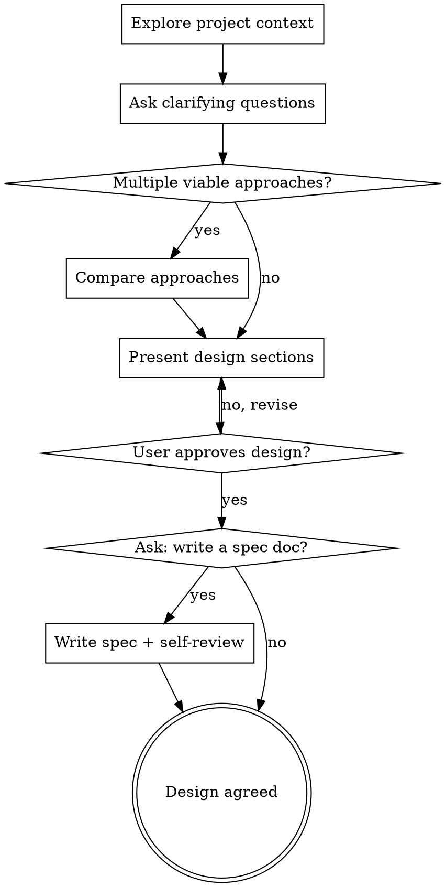

# Brainstorm Ideas Into Designs

Help turn ideas into fully formed designs through natural collaborative dialogue.

**The job of this skill is to interview the user.** Explore the project context, ask questions one at a time, propose approaches, and land on a design the user has agreed to. That is the whole deliverable. Everything else — writing it down, planning the implementation — is optional, and only happens if the user asks for it.

<HARD-GATE>
Do NOT write any code, scaffold any project, or take any implementation action until you have presented a design and the user has approved it. This applies to EVERY project regardless of perceived simplicity.
</HARD-GATE>

## Anti-Pattern: "This Is Too Simple To Need A Design"

Every project goes through this process. A todo list, a single-function utility, a config change — all of them. "Simple" projects are where unexamined assumptions cause the most wasted work. The design can be short (a few sentences for truly simple projects), but you MUST present it and get approval.

## Checklist

You MUST create a task for each of these items and complete them in order:

1. **Explore project context** — check files, docs, recent commits
2. **Ask clarifying questions** — one at a time, understand purpose/constraints/success criteria
3. **Compare approaches (only if they differ meaningfully)** — trade-offs and your recommendation; skip when one approach is clearly right and go straight to the design
4. **Present design** — in sections scaled to their complexity, get user approval after each section
5. **Ask whether to write a spec doc** — and write one only if the user says yes

## Process Flow

**The terminal state is an agreed design.** What happens next — implement now, plan first, sleep on it — is the user's call. Don't assume it, ask.

## The Process

**Understanding the idea:**

- Check out the current project state first (files, docs, recent commits)
- Before asking detailed questions, assess scope: if the request describes multiple independent subsystems (e.g., "build a platform with chat, file storage, billing, and analytics"), flag this immediately. Don't spend questions refining details of a project that needs to be decomposed first.
- If the project is too large for a single design, help the user decompose into sub-projects: what are the independent pieces, how do they relate, what order should they be built? Then brainstorm the first sub-project through the normal design flow.
- For appropriately-scoped projects, ask questions one at a time to refine the idea
- Prefer multiple choice questions when possible, but open-ended is fine too
- Only one question per message - if a topic needs more exploration, break it into multiple questions
- Focus on understanding: purpose, constraints, success criteria

**Exploring approaches (only when they genuinely differ):**

- First judge whether there's more than one meaningfully different way to build this. Many ideas have one obvious approach — if so, say so in a sentence and go straight to the design.
- When real alternatives exist (different architectures, trade-offs, or philosophies), propose 2-3 of them with trade-offs
- Present options conversationally, lead with your recommended option, and explain why

**Presenting the design:**

- Once you believe you understand what you're building, present the design
- Scale each section to its complexity: a few sentences if straightforward, up to 200-300 words if nuanced
- Ask after each section whether it looks right so far
- Cover: architecture, components, data flow, error handling, testing
- Be ready to go back and clarify if something doesn't make sense

**Design for isolation and clarity:**

- Break the system into smaller units that each have one clear purpose, communicate through well-defined interfaces, and can be understood and tested independently
- For each unit, you should be able to answer: what does it do, how do you use it, and what does it depend on?
- Can someone understand what a unit does without reading its internals? Can you change the internals without breaking consumers? If not, the boundaries need work.
- Smaller, well-bounded units are also easier for you to work with - you reason better about code you can hold in context at once, and your edits are more reliable when files are focused. When a file grows large, that's often a signal that it's doing too much.

**Working in existing codebases:**

- Explore the current structure before proposing changes. Follow existing patterns.
- Where existing code has problems that affect the work (e.g., a file that's grown too large, unclear boundaries, tangled responsibilities), include targeted improvements as part of the design - the way a good developer improves code they're working in.
- Don't propose unrelated refactoring. Stay focused on what serves the current goal.

## After the Design: ask, don't assume

Once the user approves the design, **ask whether they want it written up**:

> "Design's agreed. Want me to write it up as a spec doc, or is this enough to go on?"

A design that lives in the conversation is often enough — it's fresh, it's agreed, and work can start immediately. A spec file earns its keep when the design must outlive this session, get reviewed by someone else, or anchor a long implementation. Let the user decide; don't litter their repo by default.

**If they say no:** you're done. The agreed design is the deliverable.

**If they say yes:**

1. Write the design to `docs/specs/YYYY-MM-DD-<topic>-design.md` (user preferences for spec location override this default)
2. Self-review it with fresh eyes and fix issues inline — no need to re-review, just fix and move on:
   - **Placeholder scan:** Any "TBD", "TODO", incomplete sections, or vague requirements? Fix them.
   - **Internal consistency:** Do any sections contradict each other? Does the architecture match the feature descriptions?
   - **Scope check:** Is this focused enough for a single implementation, or does it need decomposition?
   - **Ambiguity check:** Could any requirement be interpreted two different ways? If so, pick one and make it explicit.
3. Ask the user to review the file, apply any changes they want, then commit it

## Key Principles

- **The interview is the job** - An agreed design is the deliverable; documents and plans are opt-in extras
- **One question at a time** - Don't overwhelm with multiple questions
- **Multiple choice preferred** - Easier to answer than open-ended when possible
- **YAGNI ruthlessly** - Remove unnecessary features from all designs
- **Explore alternatives when they exist** - Propose 2-3 approaches when they genuinely differ; when one is clearly right, say so and move on
- **Incremental validation** - Present design, get approval before moving on
- **Be flexible** - Go back and clarify when something doesn't make sense
