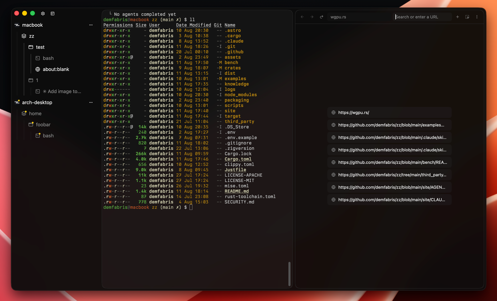

<p align="center">
  
</p>

# zz

zz is tmux, ghostty and gpui love triangle



## Is it any good?

Yes.

### In math notation:

> **zz := gpui(tmux ∪ ghostty)**

## Features

A multiplexer that ships as a native GPU app. A background daemon owns
your sessions, so closing the window detaches instead of killing your work.

- `tmux` superset implemented in Rust, bring your `.tmux.conf` and muscle memory.
- Remote machines over plain ssh. Their sessions, windows, and panes sit in the
  same control plane.
- Browser panes: a real Chromium composited on the same surface as your
  terminals, split and targeted like any other pane.
- macOS, Linux (Wayland). Experimental Windows and WSL support.

# Pty Benchmarks

> `zz` core is at least ~8x faster than `tmux` + any terminal emulator

**macOS · Metal** — Apple M4 Max

| terminal     | cat-ascii (MB/s) | cat-unicode (MB/s) | doom-fire (fps) |
| ------------ | ---------------: | -----------------: | --------------: |
| **zz**       |          **328** |             **98** |         **668** |
| ghostty-tip  |              294 |                 94 |             650 |
| cmux         |              285 |                 86 |             627 |
| kero         |              273 |                  x |               x |
| ghostty      |               94 |                 69 |             630 |
| iterm2       |               87 |                  x |               x |
| ghostty+tmux |               44 |                 19 |             194 |
| rio          |               28 |                 30 |             125 |

**Linux · Vulkan** — AMD Ryzen 7 7800X3D, Radeon 7900 XTX, Wayland

| terminal     | cat-ascii (MB/s) | cat-unicode (MB/s) | doom-fire (fps) |
| ------------ | ---------------: | -----------------: | --------------: |
| **zz**       |          **645** |             **81** |        **1285** |
| ghostty-tip  |              637 |                 61 |            1216 |
| rio          |              487 |                124 |            1191 |
| alacritty    |              129 |                 91 |            1255 |
| ghostty      |               98 |                 45 |             653 |
| limux        |               94 |                 54 |             618 |
| ghostty+tmux |               56 |                 17 |             201 |

_Median of 5 runs at 180×50. `cat-ascii` and `cat-unicode` are throughput,
`doom-fire` is frame rate; higher is better. `x` means crashed or timed out.
Reproduce with [`bench/run.sh`](bench/run.sh) and [`bench/summarize.sh`](bench/summarize.sh)._

# Install

macOS, Apple Silicon:

```sh
brew install --cask demfabris/zz/zz
```

AUR:

```sh
paru zz-bin
```

Debian/Ubuntu 24.04+, from a release `.deb`:

```sh
sudo apt install ./zz-<version>-linux-<arch>.deb
```

# Development

Install [just](https://github.com/casey/just)

## Prerequisites

- Rust 1.97.0
- Zig 0.16.0
- CMake 3.21+ and Ninja: the CEF C++ wrapper is compiled from source.
- Linux: `cmake curl desktop-file-utils ninja-build libfontconfig-dev libwayland-dev libx11-xcb-dev libxcb1-dev libxkbcommon-dev libxkbcommon-x11-dev`.

```sh
just [build|install] [mac|linux]
just dmg
just pacman-[package|install]
just deb-[package|install]
```

# Connecting

The sidebar shows every machine you have added, each expanding into its own
sessions, windows, and panes. Click a session to attach to it. Add one from the
menu on your own machine's row, remove one from the menu on its own row, or from
a shell:

```sh
zz fleet add desktop you@desktop
zz fleet list
zz fleet remove desktop
```

Or directly in zz's config file:

```
host-desktop = ssh://you@desktop
host-gpu     = ssh://gpu-box:2222
```

## Browser egress

Browser panes always render locally, but a pane opened while you are attached to
a remote host sends its traffic back out through that host over `ssh -D`, so
`localhost:3000` is the dev server _there_. Set `browser-egress = false` to keep
browsing local.

## License

Dual-licensed under [MIT](LICENSE-MIT) or [Apache-2.0](LICENSE-APACHE).
