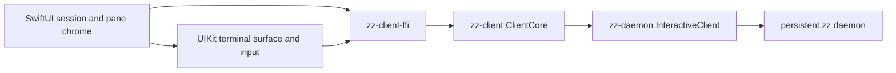

# Overview

The iPhone client is a native Apple application under `clients/ios`. SwiftUI owns the app shell and
UIKit owns the terminal view and input bridge. The deleted `crates/zz-ios` and
`crates/zz-gpui-ios` implementation compiled the desktop GPUI client for iPad; none of that platform
backend remains in the workspace.

The phone does not reproduce the desktop split layout. It shows one session at a time, presents the
active window's panes as uniform cards, and opens one pane fullscreen. A horizontally scrollable
session selector stays at the bottom, following Safari's mobile tab-group shape without copying
browser semantics that do not belong to zz.

iPad is intentionally not an adaptive branch of this target. Its layout and bundle will be designed
as a separate client.

# Experience

## Pane overview

- The selected session's active window is the only window represented.
- Its panes appear as a two-column card grid; desktop split ratios do not constrain the phone.
- Terminal cards contain live frame previews drawn with a smaller font over the terminal's stable
  fullscreen grid.
- Browser, Agent, Editor, and picker panes open fullscreen as explicit placeholders.
- Closing a pane requires native destructive confirmation because it stops the pane's process.
- Each card is an accessible button with a separate 44-point close target whose visible control stays
  compact.
- New Pane and Refresh Connection live in the trailing session-actions menu instead of occupying the
  overview header. New Pane targets the session's terminal and asks the daemon to create another
  terminal pane.

## Fullscreen terminal

Tapping a terminal card opens a single interactive terminal. Three separate controls float over the
terminal: a grid button, a full-width pane selector, and a keyboard-shortcuts button. The pane
selector uses the session rail's finger-tracking page transition, so its outgoing and incoming
capsules move, fade, and scale with a horizontal drag before the adjacent pane opens. Leaving
fullscreen resigns first responder so the software keyboard disappears with it.

The center control has a second mode instead of installing a UIKit keyboard accessory. Its keyboard
button replaces the pane selector with a horizontally scrollable row containing Escape, Tab, sticky
Control and Alt, four arrows, and Prefix while the two circular controls stay in place. Hardware keys
use the same raw-key FFI path. Text input remains Unicode and IME aware through `UIKeyInput`.

A two-finger pinch changes the current pane's terminal font in one-point steps from 9 through 23
points. Each crossed step emits selection haptics and reports the resulting cell geometry to the
daemon; the chosen step remains local to that pane for the lifetime of the client connection.

## Session rail

The bottom rail has three pieces: a leading new-session button, a native horizontally paged strip,
and a trailing session-actions menu. Every session owns one full-width glass capsule in the center
space. During a drag, the focused capsule follows the finger while the adjacent capsule enters from
the edge; both scale and fade interactively before the strip settles on one target. Settling attaches
that session, while daemon-driven attachment scrolls the strip to the authoritative selection.

The plus is single-flight. It shows progress until a reduced snapshot contains a session ID that did
not exist when the request began. If the request cannot be sent or no new session appears within the
bounded verification window, the client reports an action error instead of treating request
submission as successful creation.

The selected rail item is desired presentation state, while the reduced core's attached session is
authoritative transport state. The store tracks an attachment request until the matching snapshot
lands. If an attached session disappears, it issues a real attach for the surviving selected session
or the first live fallback; changing the rail alone cannot enable viewport fanout.

# Architecture



Swift does not parse mux commands, apply terminal patches, resolve pane keys, or own transport
threads. `zz-client-ffi` owns the connection and reduced snapshots. The application polls the FFI's
wake descriptor with `DispatchSourceRead`, drains typed events, then publishes immutable Swift model
objects on the main actor.

`zz_mux_snapshot` is caller-owned and exposes sessions plus the panes in each session's active
window. `zz_viewport` is caller-owned and keeps immutable cell, style, grapheme, color, cursor, and
generation planes alive until release. Damage rows travel with viewport events so UIKit can
invalidate only changed terminal bands.

# Terminal rendering

`TerminalGridView` draws the daemon's render-ready cell plane directly. The first slice supports:

- default and per-style foreground/background colors;
- bold, italic, faint, invisible, underline, strike, and overline attributes;
- scalar and interned-grapheme glyphs;
- wide cells and spacer suppression;
- cursor visibility, shape, color, width, and blinking;
- generation-based updates and row damage;
- touch scrolling and resize reporting in terminal cells.

The client does not run a second VT parser and does not reconstruct styled rows from plain text.
Preview terminal views disable UIKit hit testing and never report a resize, so touches reach the
SwiftUI card button and entering or leaving the overview does not reflow the PTY. Fullscreen terminal
views enable their tap, pan, pinch, and keyboard input and derive resize reports from their actual
safe-area-adjusted bounds. The store deduplicates identical layouts per pane.

The terminal's decoded background color paints through every system inset while glyphs stay below
the top safe area. The surface ignores only the bottom container inset, not the keyboard region, so a
docked software keyboard reduces the renderer bounds and PTY rows instead of covering them. Hiding
the keyboard restores the larger grid; a floating keyboard remains an overlay. Floating controls
remain inside the live safe area.

# Build and run

`XcodeGen` generates `clients/ios/ZZMobile.xcodeproj` from `project.yml`. The project is intentionally
generated and ignored. Its pre-build phase cross-compiles `zz-client-ffi` as an arm64 static library
for the selected Apple SDK and links it into Swift through `ZZ-Bridging-Header.h`.

```sh
just ios-build
just ios
just ios-device <device-name>
```

`just ios` builds, boots an available iPhone simulator, installs `dev.zz.ios`, injects `ZZ_SOCKET`,
and launches it. The first milestone is the simulator attached to a daemon on the same Mac. The
device recipe proves signing, installation, and launch; a device-reachable remote transport is not
yet implemented.

# Boundaries and next work

- Add phone-to-host transport and host selection before treating physical-device attach as usable.
- Design the iPad client as its own target instead of adding size-class branches here.
- Decide native representations for Browser, Agent, Editor, and picker panes.
- Add automated Swift model and renderer tests beyond the native build lane.

The C ABI smoke test creates and attaches a session, creates a second terminal pane, renders styled
content, types through the raw-key path, kills the attached session, reattaches a survivor and
recovers its viewport, then frees and reconnects against a real daemon.

# Key files

| File | Role |
| --- | --- |
| `clients/ios/project.yml` | Native iPhone target, bundle settings, and Rust pre-build phase. |
| `clients/ios/Sources/ContentView.swift` | Session rail, pane grid, placeholders, and fullscreen shell. |
| `clients/ios/Sources/ZZStore.swift` | FFI connection, event drain, snapshots, actions, and published models. |
| `clients/ios/Sources/TerminalSurface.swift` | UIKit terminal drawing and keyboard input. |
| `clients/ios/Sources/TerminalFrame.swift` | Caller-owned viewport planes exposed to the renderer. |
| `crates/zz-client-ffi/include/zz-client.h` | Stable C boundary consumed by Swift. |
| `scripts/ios-sim.sh` | Simulator build, install, socket injection, and launch. |

# Related

- [Client core and contract](/designs/client-core-and-contract.md)
- [zz-client-ffi](/crates/zz-client-ffi.md)
- [Packed terminal lanes](/protocol/terminal-lanes.md)
