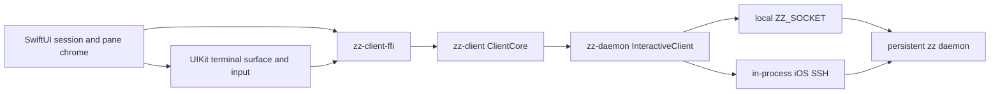

# Overview

The native Apple client is a universal application under `clients/ios`. SwiftUI owns the app shell
and UIKit owns the terminal view and input bridge. The deleted `crates/zz-ios` and
`crates/zz-gpui-ios` implementation compiled the desktop GPUI client for iPad; none of that platform
backend remains in the workspace.

Compact widths keep the phone interaction: one session at a time, uniform pane cards, one pane
fullscreen, and a horizontally scrollable session selector. Regular widths use an adaptive
`NavigationSplitView`: the native sidebar presents the full session, window, and pane tree while the
detail column mounts every visible pane at the daemon's split ratios. Both modes share one bundle,
store, FFI connection, terminal renderer, and input owner.

# Experience

## Host connection

The physical-device path stores one normalized `ssh://user@host` endpoint in `UserDefaults`. It
reconnects to that host with the app's own Ed25519 identity, whose private half lives in the iOS
Keychain. The setup screen exposes the OpenSSH public key for copying into the host's
`~/.ssh/authorized_keys`. A password can authenticate one connection, but it remains in memory for
that attempt only and is never persisted.

iOS uses the daemon client's in-process `russh` transport instead of spawning an `ssh` executable.
An unknown or changed server key pauses connection and shows the offered fingerprint. The user can
reject it, trust it for one connection, or save it. Replacing a changed key removes every saved key
for that host using the offered algorithm before writing the new key under the known-hosts lock.
Authentication tries the app identity first, then drives the server's keyboard-interactive prompt
batches and password method. Password, passphrase, verification-code, and other OTP prompts keep the
server's own wording and echo policy. Cancelling any prompt stops that connection attempt.

After authentication, the client probes the remote socket, starts the remote daemon when necessary,
then carries the normal zz protocol through `zz proxy`. The host must have a compatible `zz` in its
login-shell `PATH`, `$HOME/.local/bin`, `/opt/homebrew/bin`, or `/usr/local/bin`; the remote scripts
append those standard install locations before lookup. SSH establishment runs away from the main
actor, so the native connection screen remains responsive during DNS, authentication, and startup.

An established connection that drops retains the immutable terminal frames and selected session and
pane while a quiet reconnect banner counts through a capped 1, 2, 4, 8, 16-second retry ladder.
Network restoration starts the next attempt immediately. Authentication, rejected host keys,
configuration errors, and protocol incompatibility stop automatic retries and return to setup;
transport, probe, forwarding, and daemon-start failures retry. A successful reconnect creates a fresh
client core, reattaches the remembered session, restores the last keyboard-hidden terminal geometry,
and selects the exact remembered pane, including a pane in a formerly inactive window.

This slice deliberately selects one host at a time. It does not reproduce the desktop fleet chooser
or aggregate sessions from several daemons. `ZZ_SOCKET` remains the simulator override and bypasses
saved-host setup for the local development loop.

The first attach to a host offers a one-time tmux config import, mirroring the desktop first-run
flow: accepting runs the daemon's `import-tmux-config`, which copies the host's `~/.tmux.conf` (then
`$XDG_CONFIG_HOME/tmux/tmux.conf`, then `~/.config/tmux/tmux.conf`) verbatim into `zz/mux.conf` and
reloads, so host binds like hjkl pane navigation go live. The offer is remembered per normalized
endpoint; the Prefix Keys sheet re-runs the import on demand and shows the resulting live table.

## Pane overview

- The selected session's active window is the only window represented.
- Its panes appear as a two-column card grid; desktop split ratios do not constrain the phone.
- Terminal cards contain live frame previews drawn with a smaller font over the terminal's stable
  fullscreen grid.
- Agent cards show structured status and approval attention. Browser, Editor, and picker panes remain
  explicit placeholders.
- A compact attention strip orders blocked, failed, unseen-complete, and working Agents and opens the
  exact pane when tapped.
- Closing a pane requires native destructive confirmation because it stops the pane's process.
- Each card is an accessible button with a separate 44-point close target whose visible control stays
  compact.
- New Pane and Refresh Connection live in the trailing session-actions menu instead of occupying the
  overview header. New Pane targets the session's terminal and asks the daemon to create another
  terminal pane.

## iPad workspace

The regular-width workspace uses system navigation and toolbar surfaces so the current iPad design,
sidebar material, resizing behavior, and Liquid Glass appearance come from SwiftUI rather than a
copy of the desktop chrome. The sidebar expands sessions into all of their windows and panes. Tapping
a pane attaches its session when necessary, selects its window and pane through daemon commands, and
waits for the next reduced snapshot as confirmation.

The outline follows the Swift Playgrounds source-list grammar: each session is a strong section row,
each window is nested one level below its session, and each pane is nested one more level below its
window. Branch chevrons stay on the trailing edge and the whole 44-point row toggles with a short
expand animation. Pane labels sit next to their icons and do not use state dots. A long press on a
window or pane row offers Close Window or Close Pane through a context menu, each confirmed by a
destructive alert because closing stops the running processes. Only the selected pane
receives the Playgrounds-matched full-width source-list capsule; the attached session's active pane
is the visual fallback before an explicit pane selection exists. The balanced split-view style keeps
the material sidebar beside the workspace at regular widths while retaining the native visibility
control.

The C ABI projects every window and pane from `MuxSnapshot` and returns each visible pane's normalized
rectangle. The rectangle solver lives in `zz-client`; Swift multiplies those values by the detail
column's current size through a custom `Layout`. A zoomed pane receives the full rectangle while its
siblings remain in the sidebar without being mounted. This keeps split semantics out of Swift and
lets continuously resized iPad windows drive terminal geometry from each UIKit surface's actual
bounds.

Every visible terminal has its own retained `TerminalSurface`, stable pane-local frame slot, damage
path, and resize report. A viewport event publishes only through that pane's slot instead of
invalidating every view that observes `ZZStore`. The store still owns exactly one terminal input
target. Tapping a terminal selects the mux pane, transfers first responder and terminal focus, and
leaves the other panes live but non-keyboard-owning. When a prefix binding changes the daemon's
active pane, the next snapshot transfers that existing selection and input ownership. Panorama's
empty selection remains unchanged. Removing the selected pane transfers input to the replacement
active pane chosen by the daemon.
Standard toolbars provide New Session, New Pane, reconnect, and host actions. The iPad New Pane menu
offers Terminal and Agent. Agent creation sends one daemon command list that splits a pending picker
and materializes it while that picker remains the active command target. The connected daemon must
already have `experimental-agent-pane` enabled. The detail column omits a duplicate workspace title
and lets pane content fill each tile directly; pane identity and selection remain in the sidebar, so
per-pane chrome does not consume terminal bounds.

The system-sized principal toolbar item uses a native session menu and a flexible segmented window
picker centered around the active window. Panorama, New Pane, and More stay in the trailing native
action group, with Settings inside More. Window labels surface the structured bell, Agent, and zoom
state available in the client snapshot. The controls use the normal attachment and exact-pane
navigation paths. The current C ABI does not expose the daemon-expanded `StatusLine` payload, so
Swift does not duplicate custom `status-left`, `status-right`, justification, or clock text.

### Client settings

The native Settings sheet owns presentation choices that belong to this device: system, dark, or
light app appearance; System Mono, Menlo, or Courier New terminal text; a 9 through 23 point terminal
base size; whether a cursor that requests blinking should animate; and whether pane content may draw
through the iPad's bottom home-indicator inset. The app keeps the system accent instead of persisting
a zz-specific tint. These values persist in `UserDefaults`, update the mounted SwiftUI and UIKit
views immediately, and can be restored to the dark, System Mono, 13-point defaults in one action.
Per-pane pinch zoom remains an in-memory offset from the persisted base size.

Settings uses the same modal sheet at compact and regular widths. Opening it therefore leaves the
live iPad detail column at its current width and does not send a terminal resize merely because the
settings UI appeared. App appearance affects native chrome only. Terminal cell colors, cursor color,
shape, and visibility continue to come from the daemon-provided viewport frame. Turning off cursor
blinking makes the cursor steady without disabling ANSI blinking text. In a live split, only the
selected pane animates its cursor; other panes remain live and may still animate ANSI blinking text.

### Panorama

Regular-width iPad layouts open in Panorama, a horizontal set of session columns. Each column keeps
its session name above a window stack with its own scroll. Windows have no outer container or title;
each window's panes sit inline in the stack. The session, window, and pane material bars are absent
so the terminal geometry carries the hierarchy. A single circular glass X closes Panorama from the
top-right corner. Each window's panes preserve the normalized pane rectangles supplied by
`zz-client`, so their miniature topology matches the daemon rather than inventing a Swift-only grid.

The outer scroller and each window stack use view-aligned targets with one-target paging. During a
drag, nearby columns and cards recede by four percent, then return to full size at rest. Entering
Panorama waits for the first real window snapshot instead of completing while the app is still
connecting. The active window is captured as one fixed-size passive workspace surface at the detail
column's settled bounds. Entering removes the detail navigation bar without animation, waits for the
resulting geometry, then flies that surface into the measured window rectangle on an ease-out
curve while the session columns cascade in with a short stagger and the scroll surface fades up
behind them; the grid itself does not scale, so the measured card rectangle stays valid through the
flight. Leaving fades the surrounding content out fast and grows the fixed surface back to
fullscreen on an ease-in-out curve after the detail navigation bar returns and the destination
geometry settles. The target rectangle is locked before movement starts, and the live workspace
mounts after the exit completes. Reduce Motion fades the Panorama layer before swapping view
branches and performs no transform animation.

Panorama creates no additional interactive terminals. While it is open, the app enables the v87
terminal preview stream and retains a stable pane-local frame slot for every terminal across every
window of the attached session. Each steady card observes only its own slot and uses
`TerminalSurface(interactive: false, preview: true)`, which scales the retained viewport, ignores
input, and cannot report a resize. The daemon keeps `visible_terminals` as the foreground window's
geometry and input authority; the extra panes travel through a separate bounded, low-priority stream.
Preview delivery does not resize a PTY or enqueue Kitty image payloads, and pending preview frames
yield to foreground and reliable traffic under backpressure. Session columns that are not attached
continue to show stable pane-kind placeholders until navigation attaches them.

The app sends `SetTerminalPreview { enabled: true }` when Panorama opens, repeats the request after a
new `Attached` event, and disables it after the exit transition or when the workspace disappears. The
store then releases inactive-window frame handles. At transition start it captures the terminal
viewport handles and Agent states for the selected window.
Its fixed-size terminal surfaces use `interactive: false, preview: false`, so they preserve detail
geometry while remaining unable to claim keyboard ownership or resize a PTY. The live workspace can
report its final settled geometry only after it replaces the transition surface.

Each pane cell is an accessible button. A tap uses the existing exact-pane navigation path, attaches
another session or selects another window as needed, then returns to the live split workspace. The
app releases terminal input ownership before it enters Panorama. Zoomed windows display the one
full-size pane that owns a normalized rectangle; the sidebar retains the hidden siblings because the
current snapshot does not expose their pre-zoom rectangles.

## Fullscreen terminal

Tapping a terminal card opens a single interactive terminal. Three separate controls float over the
terminal: a grid button, a full-width pane selector, and a keyboard-shortcuts button. The pane
selector uses the session rail's finger-tracking page transition, so its outgoing and incoming
capsules move, fade, and scale with a horizontal drag before the adjacent pane opens. Leaving
fullscreen resigns first responder so the software keyboard disappears with it.

The center control has a second mode instead of installing a UIKit keyboard accessory. Its keyboard
button replaces the pane selector with a horizontally scrollable row containing Escape, Tab, Shift,
Control, Alt, four arrows, Prefix, Copy, and Compose while the two circular controls stay in place.
Shift, Control, and Alt are one-shot after one tap, lock after a double tap, and clear when a locked
button is tapped again. Compose opens a native multiline editor, preserving IME, paste, and dictation
before sending the text as one terminal input. Hardware key press, repeat, and release events use the
same raw-key FFI path. Direct text input remains Unicode and IME aware through `UIKeyInput`.

A long press followed by a drag sends semantic selection press, drag, and release actions to the
terminal engine. Copy asks the daemon for the selected text and writes the resulting typed clipboard
event to `UIPasteboard`; Swift never rebuilds selection text from rendered cells.

The store owns one explicit input target: no pane or one terminal pane. A focus request advances an
activation token, and UIKit reconciles first-responder state on the next main-actor turn only while
the matching surface is mounted and the scene is active. Overview navigation and pane switching
release the old responder and pane/application focus through the same state transition. The initial
connection waits for `ZZ_EVENT_ATTACHED`, then sends the separate v73 client-window focus signal.
Each later `ZZ_EVENT_ATTACHED` does the same for session selection, recovery, and recreated-session
flows. `zz_client_attach` returning true confirms the request write, so the store does not send scene
focus from that return path. Attachment does not replay pane focus. A foreground or background
transition sends the terminal input owner's distinct pane/application focus signal so the child
application retains its `CSI I`/`CSI O` path. Backgrounding keeps the FFI client, reduced core, and
retained viewports alive.

A two-finger pinch changes the current pane's terminal font in one-point steps from 9 through 23
points. Each crossed step emits selection haptics and reports the resulting cell geometry to the
daemon; the chosen step remains local to that pane for the lifetime of the client connection.

## Agent supervision

The app consumes the daemon's retained `AgentPaneWire` state through typed FFI accessors. It does not
subscribe to or retain the heavy transcript stream. An Agent pane shows connection phase, title,
queued prompts, failure text, git branch and change totals, and the current permission request. Each
permission option is parsed once in Rust and rendered as a native approval or rejection action;
responses and turn cancellation travel through the daemon-owned Agent commands.

The mounted multiline composer keeps an independent draft for every pane. Submit sends
`agent-send --submit` to an idle Agent or queues the prompt while it is running; an empty action while
running becomes Stop. The pane renders the conversation as a thread: every submitted prompt appears
as a user bubble with a Working, Done, or Failed receipt, interleaved with the agent's streamed
text, collapsible thought blocks, and tool-call rows carrying their live status. The receipts come
from the thread's record of prompts the app sent, settled by the daemon's done and failed attention
edges. The transcript itself arrives as JSON journal batches through
`zz_client_agent_updates_next`, reduced in Swift with the same cursor rules as the desktop shell:
per-pane cursor, idempotent overlap, gap-triggered replay from the cursor, restoring-reset jumps,
and replay on lane overflow. Swift parses message chunks, thought chunks, and tool calls from the
ACP `session/update` payloads and skips the variants it has no rendering for, including user
echoes the thread already shows. A settings bar above the composer holds the session, model, and
effort pickers. The model and effort menus come from the adapter's session config options, with the
legacy mode list as fallback; all three lock while a turn runs or an approval is pending, matching
the desktop. The session button shows the current working directory and opens the session sheet,
which lists every project session with its directory, switches between them, deletes them with
confirmation, or starts a new session in a typed absolute path. Switching sessions resets the
visible transcript because the journal belongs to the previous session. Swift primes retained
agent state when an agent pane appears without any, so attaching to a session with live agents
does not stick on the connecting empty state while the daemon already holds their state.

`ClientCore` derives attention edges while reducing Agent state. A transition into a permission
request, working to idle, or first failure becomes a lossless event flag, so a fast transition cannot
disappear between two Swift snapshots. Hidden completion remains in the attention strip until the
pane opens.

Blocked, complete, and failed edges can schedule local notifications with a stable pane identity.
Tapping one routes through the session and pane IDs to the exact Agent. These are local notifications
created while iOS is still receiving the live event stream; zz does not provide push delivery or a
background Agent inbox, so a suspended or terminated app cannot announce later daemon events.

The app registers `zz://pane?session=<id>&pane=<id>`, `zz://open?...`, and `zz://attention` routes.
App Shortcuts expose Open zz, Reconnect zz, and Agent Attention. Unknown routes are rejected, and
notification, URL, and Shortcut navigation all converge on the same exact-attachment path.

## Session rail

The bottom rail has three pieces: a leading new-session button, a native horizontally paged strip,
and a trailing session-actions menu. Every session owns one full-width glass capsule in the center
space. During a drag, the focused capsule follows the finger while the adjacent capsule enters from
the edge; both scale and fade interactively before the strip settles on one target. Settling attaches
that session, while daemon-driven attachment scrolls the strip to the authoritative selection.

The plus is single-flight. It shows progress until a reduced snapshot contains a session ID that did
not exist when the request began. If the request cannot be sent or no new session appears within the
bounded verification window, the client reports an action error instead of treating request
submission as successful creation.

The selected rail item is desired presentation state, while the reduced core's attached session is
authoritative transport state. The store tracks an attachment request until the matching snapshot
lands. If an attached session disappears, it issues a real attach for the surviving selected session
or the first live fallback; changing the rail alone cannot enable viewport fanout.

# Architecture



Swift does not parse mux commands, apply terminal patches, resolve pane keys, or own transport
threads. `zz-client-ffi` owns the connection and reduced snapshots. The application polls the FFI's
wake descriptor with `DispatchSourceRead`, drains typed terminal, Agent, clipboard, and disconnect
events, then publishes immutable Swift model objects on the main actor.

`zz_mux_snapshot` is caller-owned and exposes the complete session, window, and pane hierarchy plus
normalized visible pane rectangles. The older active-window accessors remain available.
`zz_viewport` is caller-owned and keeps immutable cell, style, grapheme, color, cursor, and generation
planes alive until release. Damage rows travel with viewport events so UIKit can invalidate only
changed terminal bands.

# Terminal rendering

`TerminalGridView` draws the daemon's render-ready cell plane directly. The first slice supports:

- default and per-style foreground/background colors;
- bold, italic, faint, invisible, underline, strike, and overline attributes;
- scalar and interned-grapheme glyphs;
- wide cells and spacer suppression;
- cursor visibility, shape, color, width, and blinking;
- generation-based updates and row damage;
- touch scrolling and resize reporting in terminal cells;
- daemon-owned semantic selection and clipboard extraction.

The client does not run a second VT parser and does not reconstruct styled rows from plain text.
Preview terminal views disable UIKit hit testing and never report a resize, so touches reach the
SwiftUI card button and entering or leaving the overview does not reflow the PTY. Fullscreen terminal
views enable their tap, pan, pinch, and keyboard input and derive resize reports from their actual
safe-area-adjusted bounds. The store deduplicates identical layouts per pane.

The terminal's decoded background color paints through every system inset while glyphs respect both
the top and bottom safe areas. A docked software keyboard reduces the renderer's native bounds and
PTY rows instead of covering them; no keyboard height is calculated or applied by hand. Hiding the
keyboard restores the larger grid, a floating keyboard remains an overlay, and the three-piece pane
bar continues to float over the safe-area-contained terminal.

Keyboard notifications classify layouts rather than driving layout. The store sends every live grid
to the daemon but remembers only keyboard-hidden geometry as the reconnect baseline. After a retry or
detach, it reapplies that stable grid once attachment lands; a still-visible docked keyboard can then
report its smaller transient grid without replacing the baseline. Keyboard visibility is shared
across terminal surfaces so a pane handoff while the keyboard stays open cannot bless a short grid as
stable. Leaving interactive input also restores the stable grid, so overview previews and inactive
sessions never inherit the docked keyboard's height.

# Build and run

`XcodeGen` generates `clients/ios/ZZMobile.xcodeproj` and `Support/Info.plist` from `project.yml`.
The project is intentionally generated and ignored. Its pre-build phase cross-compiles
`zz-client-ffi` as an arm64 static library for the selected Apple SDK and links it into Swift through
`ZZ-Bridging-Header.h`. The universal target compiles the shared `assets/zz.icon` Icon Composer
document for its iPhone, iPad, and App Store icon variants.

```sh
just ios-build
just ios-test
just ios
just ipad-build
just ipad-test
just ipad
just ios-device <device-name>
ZZ_IOS_REUSE_CLIENT_CORE=1 just ios-device <device-name>
just ios-preview [build-number]
```

`just ios` builds, boots an available iPhone simulator, installs `dev.zz.ios`, injects `ZZ_SOCKET`,
and launches it against a daemon on the same Mac. The matching `just ipad` recipes select an iPad
simulator while building the same universal application. `just ios-device` signs, installs, and
launches the app on a named Apple device; the app then asks for one SSH host and can copy its generated
public key or use a one-shot password. Physical-device development builds use Debug by default;
`ZZ_IOS_CONFIGURATION=Release` selects Release when needed. Simulator tests can run against either
device family. For a Swift-only device iteration, `ZZ_IOS_REUSE_CLIENT_CORE=1` skips Cargo and copies
the existing target archive; it fails when that archive is missing, and must not be used after a Rust
or FFI change.

`just ios-preview` creates a fresh Release archive, derives the marketing version from the workspace,
uses the optional numeric argument or a UTC timestamp as the unique build number, and uploads through
Xcode automatic signing. Its export options mark the build TestFlight Internal Only, so that uploaded
build can be assigned only to internal tester groups and cannot be promoted to external testing or the
App Store. Local runs use the developer account saved in Xcode. Automation can instead provide
`APPLE_API_KEY_PATH`, `APPLE_API_KEY_ID`, and `APPLE_API_ISSUER_ID` without storing credentials in the
repository.

# Boundaries and next work

- Decide whether the one-host phone model needs a small host history without importing the desktop
  fleet UI.
- Continue physical-iPad visual tuning as pane types become native; the 2026-08-30 device run used
  Xcode 26.6 and the iOS 26.5 SDK to verify the outline, split workspace, and Panorama on iPadOS 27.
- Decide whether zoomed Panorama cards should expose hidden sibling panes; the current snapshot only
  gives the zoomed pane a rectangle.
- Decide native representations for Browser, Editor, and picker panes.
- Export the daemon-expanded status payload through the C ABI before reproducing custom tmux status
  formats. The C ABI now exports Agent journal batches (`zz_client_agent_updates_next`,
  `zz_client_agent_lagged_next`, `zz_client_agent_replay`), session replies
  (`zz_client_agent_sessions_next` plus list, new, switch, and delete ops), and the config and mode
  blobs with their setters; the app renders the transcript, the model, effort, and session pickers
  from them, and still skips richer payloads such as diffs, images, plans,
  and usage until a native representation exists.
- Add a push-capable background Agent inbox only if the product needs notifications while the app is
  suspended or terminated; the current local-notification path deliberately makes no such claim.
- Add one daemon-backed UI automation smoke for software-keyboard frame behavior once the fixture can
  launch deterministically in Xcode's test host.

The C ABI smoke test checks typed endpoint failure, creates and attaches a session, creates a second
terminal pane, renders styled content, types through the raw-key path, exercises semantic selection,
clipboard, and Agent symbols, kills the attached session, reattaches a survivor and recovers its
viewport, then frees and reconnects against a real daemon. Rust unit tests cover Agent attention
edges and SSH prompt and failure classification.

The Swift suite covers host endpoint normalization, live and keyboard-sized grid calculation, stable
reconnect selection, bounded backoff, deduplicated layout updates, exclusive input ownership,
modifier locking, known deep-link routes, persisted client settings including the home-indicator
option, per-pane Agent drafts, thread receipts, transcript cursor rules, config, mode, and session parsing, and composer action policy, global font size plus per-pane zoom, and
cursor blink policy.

# Key files

| File | Role |
| --- | --- |
| `clients/ios/project.yml` | Universal iPhone and iPad target, URL scheme, bundle settings, and Rust pre-build phase. |
| `clients/ios/Sources/ContentView.swift` | Host setup, compact phone shell, regular-width session tree, all-session Panorama, and split pane workspace. |
| `clients/ios/Sources/Models.swift` | Host, reconnect, SSH prompt, Agent, modifier, deep-link, input, and terminal geometry policies. |
| `clients/ios/Sources/ZZStore.swift` | Connection recovery, event drain, exact routing, snapshots, actions, and published models. |
| `clients/ios/Sources/TerminalSurface.swift` | UIKit terminal drawing, selection, and keyboard input. |
| `clients/ios/Sources/TerminalFrame.swift` | Caller-owned viewport planes exposed to the renderer. |
| `clients/ios/Sources/SSHPromptBroker.swift` | Synchronous C callback bridge to native trust and secret prompts. |
| `clients/ios/Sources/AgentNotifications.swift` | Local Agent attention notifications and exact-pane routing. |
| `clients/ios/Sources/AppIntents.swift` | Open, reconnect, and Agent-attention App Shortcuts. |
| `clients/ios/Sources/ClientSettings.swift` | Persisted appearance, terminal, and iPad layout settings. |
| `clients/ios/Sources/ClientSettingsView.swift` | Native settings form and live terminal preview. |
| `clients/ios/Tests/Unit/TerminalInteractionTests.swift` | Simulator policy regressions. |
| `crates/zz-client-ffi/include/zz-client.h` | Stable C boundary consumed by Swift. |
| `scripts/ios-sim.sh` | Simulator build, install, socket injection, and launch. |
| `scripts/ios-testflight.sh` | Release archive and internal-only TestFlight upload. |

# Related

- [Client core and contract](/designs/client-core-and-contract.md)
- [zz-client-ffi](/crates/zz-client-ffi.md)
- [Packed terminal lanes](/protocol/terminal-lanes.md)
