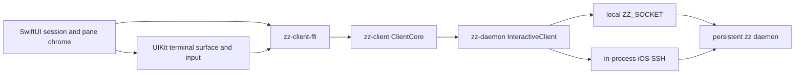

# Overview

The native Apple client is a universal application under `clients/ios`. SwiftUI owns the app shell
and UIKit owns the terminal view and input bridge. The deleted `crates/zz-ios` and
`crates/zz-gpui-ios` implementation compiled the desktop GPUI client for iPad; none of that platform
backend remains in the workspace.

Compact widths keep the phone interaction: one session at a time, uniform pane cards, one pane
fullscreen, and a horizontally scrollable session selector. Regular widths use an adaptive
`NavigationSplitView`: the native sidebar presents the full session, window, and pane tree while the
detail column mounts every visible pane at the daemon's split ratios. Both modes share one bundle,
store, FFI connection, terminal renderer, and input owner.

# Experience

## Host connection

The physical-device path stores one normalized `ssh://user@host` endpoint in `UserDefaults`. It
reconnects to that host with the app's own Ed25519 identity, whose private half lives in the iOS
Keychain. The setup screen exposes the OpenSSH public key for copying into the host's
`~/.ssh/authorized_keys`. A password can authenticate one connection, but it remains in memory for
that attempt only and is never persisted.

iOS uses the daemon client's in-process `russh` transport instead of spawning an `ssh` executable.
An unknown or changed server key pauses connection and shows the offered fingerprint. The user can
reject it, trust it for one connection, or save it. Replacing a changed key removes every saved key
for that host using the offered algorithm before writing the new key under the known-hosts lock.
Authentication tries the app identity first, then drives the server's keyboard-interactive prompt
batches and password method. Password, passphrase, verification-code, and other OTP prompts keep the
server's own wording and echo policy. Cancelling any prompt stops that connection attempt.

After authentication, the client probes the remote socket, starts the remote daemon when necessary,
then carries the normal zz protocol through `zz proxy`. The host must have a compatible `zz` in its
login-shell `PATH`, `$HOME/.local/bin`, `/opt/homebrew/bin`, or `/usr/local/bin`; the remote scripts
append those standard install locations before lookup. SSH establishment runs away from the main
actor, so the native connection screen remains responsive during DNS, authentication, and startup.

An established connection that drops retains the immutable terminal frames and selected session and
pane while a quiet reconnect banner counts through a 1, 2, 4, 8, 16-second retry ladder that falls
to a 30, 60, 120, 300, 600-second tier after five failures, so an outage lasting a night costs a
handful of attempts rather than thousands.
Network restoration starts the next attempt immediately. Authentication, rejected host keys,
configuration errors, and protocol incompatibility stop automatic retries and return to setup;
transport, probe, forwarding, and daemon-start failures retry. A successful reconnect creates a fresh
client core, reattaches the remembered session, restores the last keyboard-hidden terminal geometry,
and selects the exact remembered pane, including a pane in a formerly inactive window. The retained
workspace renders from one view branch across the connected and reconnecting states, so a drop never
rebuilds the terminal views, and a manual retry with retained sessions re-enters the reconnecting
banner rather than the first-connect page. A remembered session the daemon no longer has comes back
as a request-id-zero rejection; the client then attaches to the daemon's default session and reports
the rejection in the notice banner. Terminal surfaces become interactive only once a session is
attached, so nothing but the attach itself reaches the daemon before `ZZ_EVENT_ATTACHED`.

This slice deliberately selects one host at a time. It does not reproduce the desktop fleet chooser
or aggregate sessions from several daemons. `ZZ_SOCKET` remains the simulator override and bypasses
saved-host setup for the local development loop.

Since 2026-09-11 the daemon loads `zz/mux.conf` or explicit `-f` files. The iPad keeps its own
`mux.conf` in Application Support and applies its parsed preferences through the connected daemon.
Editing that file does not copy it to the host's filesystem. Desktop Settings and the CLI also
expose `import-tmux-config [path]` to copy a donor into the host's `zz/mux.conf` and reload it.

## Pane overview

- The selected session's active window is the only window represented.
- Its panes appear as a two-column card grid; desktop split ratios do not constrain the phone.
- Terminal cards contain live frame previews drawn with a smaller font over the terminal's stable
  fullscreen grid.
- Agent cards show structured status and approval attention. Browser cards show the shared URL and
  tab count; Editor cards identify desktop-only content. Picker cards offer Terminal, Browser, and Agent.
- A compact attention strip orders blocked, failed, unseen-complete, and working Agents and opens the
  exact pane when tapped.
- Closing a pane requires native destructive confirmation because it stops the pane's process.
- Each card is an accessible button with a separate 44-point close target whose visible control stays
  compact.
- New Pane and Refresh Connection live in the trailing session-actions menu instead of occupying the
  overview header. New Pane targets the session's terminal and asks the daemon to create another
  terminal pane.

## iPad workspace

The regular-width workspace uses system navigation and toolbar surfaces so the current iPad design,
sidebar material, resizing behavior, and Liquid Glass appearance come from SwiftUI rather than a
copy of the desktop chrome. The sidebar expands sessions into all of their windows and panes. Tapping
a pane attaches its session when necessary, selects its window and pane through daemon commands, and
waits for the next reduced snapshot as confirmation.

The outline follows the Swift Playgrounds source-list grammar: each session is a strong section row,
each window is nested one level below its session, and each pane is nested one more level below its
window. Branch chevrons stay on the trailing edge and the whole 44-point row toggles with a short
expand animation. Pane labels sit next to their icons and do not use state dots. A long press on a
window or pane row offers Close Window or Close Pane through a context menu, each confirmed by a
destructive alert because closing stops the running processes. Only the selected pane
receives the Playgrounds-matched full-width source-list capsule; the attached session's active pane
is the visual fallback before an explicit pane selection exists. The balanced split-view style keeps
the material sidebar beside the workspace at regular widths while retaining the native visibility
control.

The detail header appears only when the sidebar is retracted. With the sidebar open, panes use
the header's space and the sidebar retains its native visibility control. Retracting the sidebar
restores the session menu, window picker, and header buttons. Panorama keeps its header hidden
and restores it on exit only when the sidebar remains retracted.

The C ABI projects every window and pane from `MuxSnapshot` and returns each visible pane's normalized
rectangle. The rectangle solver lives in `zz-client`; Swift multiplies those values by the detail
column's current size through a custom `Layout`. A zoomed pane receives the full rectangle while its
siblings remain in the sidebar without being mounted. This keeps split semantics out of Swift and
lets continuously resized iPad windows drive terminal geometry from each UIKit surface's actual
bounds.

Every visible terminal has its own retained `TerminalSurface`, stable pane-local frame slot, damage
path, and resize report. A viewport event publishes only through that pane's slot instead of
invalidating every view that observes `ZZStore`. The store still owns exactly one terminal input
target. Tapping a terminal selects the mux pane, transfers first responder and terminal focus, and
leaves the other panes live but non-keyboard-owning. When a prefix binding changes the daemon's
active pane, the next snapshot transfers that existing selection and input ownership. Panorama's
empty selection remains unchanged. Removing the selected pane transfers input to the replacement
active pane chosen by the daemon.
Standard toolbars provide New Session, New Pane, reconnect, and host actions. The iPad New Pane menu
offers Terminal, Agent, and Choose Pane Type. `PaneKindPicker` materializes an existing picker with
`select-pane-kind -t %pane terminal|agent`; the daemon preserves the pane ID and inherited working
directory. Agent creation requires `experimental-agent-pane` on the host. Browser panes use native
WebKit; Editor panes retain desktop-only placeholders.

Each live iPad tile has a title button and a 44-point actions menu. The menu sends `split-picker -h`
or `-v`, `resize-pane -Z`, the five standard `select-layout` presets, and directional `resize-pane`
adjustments. The resize sheet lets the user choose a 1 through 50 cell step and watch the workspace
change beneath it. Swift forwards intent and renders the next normalized layout; Rust owns split
geometry. Close Pane requires confirmation. Terminal actions also expose Prefix, the daemon's key
bindings, Copy Mode, and Paste Buffer. These controls live in
`clients/ios/Sources/PaneControls.swift` (`PaneActionsMenu`, `PaneResizeSheet`).

The principal toolbar item uses a native session menu and a segmented window picker around the
active window. Device preferences control session visibility, bell and Agent indicators, alignment,
the host label, an Agent pane menu, and a 12-hour, 24-hour, or date-and-time clock. Swift derives pane
and window state from snapshots and the host from the current connection. It does not expand custom
`status-left` or `status-right` formats. Navigation uses the attachment and exact-pane paths.

### Client settings

`ClientSettingsView` presents Appearance, Terminal, Panes, Status Bar, and Multiplexer sections. On
regular-width iPad, a sidebar selects the page inside the settings sheet; compact widths use a
navigation list. The sheet stays outside the workspace size-class branch. A regular-width host
requests a fitted 900 by 700 point sheet so the settings sidebar has room to remain visible.

`ZZClientSettings` retains native appearance, terminal font and base size, cursor blinking, and the
home-indicator option in `UserDefaults`. `ZZSharedSettings` uses the shared Rust settings model with
Application Support `zz/config` and `zz/mux.conf`. The device has the same bundled terminal theme
catalog as desktop, separate light and dark theme choices, chrome presets and custom colors, an
interface font, terminal palette and cursor controls, padding, and font weight. Chrome contrast
uses native SwiftUI contrast on chrome groups without filtering terminal cells. Widget corner radius
and shadow strength affect picker cards, pane action buttons, and custom shortcut controls; native
system menus keep their platform treatment. Font choices include
System Mono, Menlo, Courier New, and bundled Fira Code, Geist Mono, and 0xProto. Per-pane pinch zoom
remains an in-memory offset from the base font size.

The pane settings control gaps, margins, corner radius, border width, background opacity, and inactive
pane dimming. Status settings control the native toolbar presentation described above. The animation
preference disables workspace animations and uses Panorama's reduced-motion path. Platform-only
settings such as desktop update indicators do not appear in the mobile pages.

Terminal color choices belong to this client. The Rust FFI applies the local terminal appearance to
an acquired viewport before UIKit draws its render-ready cells. It preserves terminal semantics,
selection, and explicit cell colors without a Swift VT parser or a daemon-wide palette override.
Cursor blink preferences preserve ANSI blinking text. In a live split, the selected pane animates
its cursor while other panes may still animate blinking text.

Mux preferences have different scope. `ZZStore.applyMuxPreferences` asks
`zz_settings_model_mobile_apply` to parse and execute the device's `mux.conf` through the connected
daemon, and repeats the application after attachment. Prefix and key bindings, mouse behavior,
copy-mode key style, history limits, and window/pane defaults use the same settings metadata as
desktop. The file belongs to this device; commands with daemon or session scope affect shared state
and other attached clients. This is not a per-client key-table profile or a remote file editor.

`third_party/rootshell-reference/UPSTREAM.md` records what rootshell settled for the grouped
settings, bundled fonts, and pane controls, and where to clone it. Its split-view implementation
commits terminal-cell resize requests to tmux. zz keeps that division of responsibility through
its existing daemon commands and the `zz-client` rectangle solver.

### Panorama

Regular-width iPad layouts open in Panorama, a horizontal set of session columns. Each column keeps
its session name above a window stack with its own scroll. Windows have no outer container or title;
each window's panes sit inline in the stack. The session, window, and pane material bars are absent
so the terminal geometry carries the hierarchy. A single circular glass X closes Panorama from the
top-right corner. Each window's panes preserve the normalized pane rectangles supplied by
`zz-client`, so their miniature topology matches the daemon rather than inventing a Swift-only grid.

The outer scroller and each window stack use view-aligned targets with one-target paging. During a
drag, nearby columns and cards recede by four percent, then return to full size at rest. Entering
Panorama waits for the first real window snapshot instead of completing while the app is still
connecting. The active window is captured as one fixed-size passive workspace surface at the detail
column's settled bounds. Entering removes the detail navigation bar without animation, waits for the
resulting geometry, then flies that surface into the measured window rectangle on an ease-out
curve while the session columns cascade in with a short stagger and the scroll surface fades up
behind them; the grid itself does not scale, so the measured card rectangle stays valid through the
flight. Leaving fades the surrounding content out fast and grows the fixed surface back to
fullscreen on an ease-in-out curve after the destination geometry settles. The detail navigation bar
returns first when the sidebar is retracted; it stays hidden with the sidebar open.
The target rectangle is locked before movement starts, and the live workspace
mounts after the exit completes. Reduce Motion fades the Panorama layer before swapping view
branches and performs no transform animation.

Panorama creates no additional interactive terminals. While it is open, the app enables the v87
terminal preview stream and retains a stable pane-local frame slot for every terminal across every
window of the attached session. Each steady card observes only its own slot and uses
`TerminalSurface(interactive: false, preview: true)`, which scales the retained viewport, ignores
input, and cannot report a resize. The daemon keeps `visible_terminals` as the foreground window's
geometry and input authority; the extra panes travel through a separate bounded, low-priority stream.
Preview delivery does not resize a PTY or enqueue Kitty image payloads, and pending preview frames
yield to foreground and reliable traffic under backpressure. Session columns that are not attached
continue to show stable pane-kind placeholders until navigation attaches them.

The app sends `SetTerminalPreview { enabled: true }` when Panorama opens, repeats the request after a
new `Attached` event, and disables it after the exit transition or when the workspace disappears. The
store then releases inactive-window frame handles. At transition start it captures the terminal
viewport handles and Agent states for the selected window.
Its fixed-size terminal surfaces use `interactive: false, preview: false`, so they preserve detail
geometry while remaining unable to claim keyboard ownership or resize a PTY. The live workspace can
report its final settled geometry only after it replaces the transition surface.

Each pane cell is an accessible button. A tap uses the existing exact-pane navigation path, attaches
another session or selects another window as needed, then returns to the live split workspace. The
app releases terminal input ownership before it enters Panorama. Zoomed windows display the one
full-size pane that owns a normalized rectangle; the sidebar retains the hidden siblings because the
current snapshot does not expose their pre-zoom rectangles.

## Fullscreen terminal

Tapping a terminal card opens a single interactive terminal. Three separate controls float over the
terminal: a grid button, a full-width pane selector, and a keyboard-shortcuts button. The pane
selector uses the session rail's finger-tracking page transition, so its outgoing and incoming
capsules move, fade, and scale with a horizontal drag before the adjacent pane opens. Leaving
fullscreen resigns first responder so the software keyboard disappears with it.

Previous and next pane actions use the same daemon-backed selection path as sidebar navigation,
so the visible pane and mux active pane agree after the next snapshot.

The center control has a second mode instead of installing a UIKit keyboard accessory. Its keyboard
button replaces the pane selector with a horizontally scrollable row containing Escape, Tab, Shift,
Control, Alt, four arrows, Prefix, Copy, and Compose while the two circular controls stay in place.
Shift, Control, and Alt are one-shot after one tap, lock after a double tap, and clear when a locked
button is tapped again. Compose opens a native multiline editor, preserving IME, paste, and dictation
before sending the text as one terminal input. Hardware key press, repeat, and release events use the
same raw-key FFI path. Direct text input remains Unicode and IME aware through `UIKeyInput`.
The Prefix button enters the connected client's daemon-owned `prefix` key table and acquires terminal
input for the next key. Hardware F1 through F12 and Insert use the raw-key path, including modifiers
and press, repeat, and release events.

A press followed by a drag sends semantic selection press, drag, and release actions to the terminal
engine. Selection arms after 150 milliseconds of stillness or as soon as the finger travels 5 points,
whichever comes first, so a deliberate drag selects at once while a flick still scrolls; UIKit's own
recognizer exclusion arbitrates the two. A `UITextLoupeSession` magnifies the drag, and selection
haptics tick once per crossed cell rather than once per gesture. Copy asks the daemon for the
selected text and writes the resulting typed clipboard event to `UIPasteboard`; Swift never rebuilds
selection text from rendered cells.

Paste is a separate verb from typing. `zz_client_paste` reaches the daemon's paste path, which wraps
the text for bracketed-paste mode when the program enabled DECSET 2004, translates newlines
otherwise, and keeps the bytes away from the key tables. Routing a paste through the typing verb
would deliver line feeds a shell runs as separate commands and let a pasted prefix byte be swallowed.
Any command this client runs that prints something also opens a daemon-side command-output view,
which switches the client to the pane's copy-mode table and swallows its terminal input; the client
does not render that view, so it cancels it through `zz_client_cancel_command_output` after every
drained reply, tracked or not, because the daemon installs the view before it answers. The cancel is
a semantic action rather than a keystroke because `mode-keys vi` resolves
Escape to clear-selection, which leaves copy mode running.

The store owns one explicit input target: no pane or one terminal pane. A focus request advances an
activation token, and UIKit reconciles first-responder state on the next main-actor turn only while
the matching surface is mounted and the scene is active. Overview navigation and pane switching
release the old responder and pane/application focus through the same state transition. The initial
connection waits for `ZZ_EVENT_ATTACHED`, then sends the separate v73 client-window focus signal.
Each later `ZZ_EVENT_ATTACHED` does the same for session selection, recovery, and recreated-session
flows. `zz_client_attach` returning true confirms the request write, so the store does not send scene
focus from that return path. Attachment does not replay pane focus. A foreground or background
transition sends the terminal input owner's distinct pane/application focus signal so the child
application retains its `CSI I`/`CSI O` path. Backgrounding keeps the FFI client, reduced core, and
retained viewports alive, and holds a `UIApplication` background task for whatever budget iOS grants
so a brief app switch does not cost a reconnect. When that budget expires, an in-flight attempt and
any pending retry are cancelled; an established connection is left to the system, and the disconnect
it reports on thaw enters the ladder. Returning to the foreground suppresses failure escalation for
five seconds, because a socket the system froze reads as stalled rather than dead.

A two-finger pinch changes the current pane's terminal font in one-point steps from 9 through 23
points. Each crossed step emits selection haptics and reports the resulting cell geometry to the
daemon; the chosen step remains local to that pane for the lifetime of the client connection.

## tmux controls

`TmuxOverlay` renders command prompts, confirmation prompts, tree and buffer choosers, pane
indicators, menus, and command output from `zz_client_tmux_state_json`. Swift sends typed actions
through `zz_client_tmux_action_json`; Rust retains chooser selection, prompt editing, and command
execution. The overlay prevents underlying terminal input from consuming its gestures.

`TmuxCopyBar` appears for panes in the daemon's copy-mode state. It exposes selection, clipboard
copy, search, match navigation, page movement, and exit. Hardware keys continue through the raw-key
path so the daemon's vi/emacs tables remain authoritative. `TmuxBindingsView` lists and searches the
published key tables, including custom tables, with command notes and repeat behavior. Prefix arms
the daemon's prefix table instead of sending a literal prefix byte to the PTY.

## Agent supervision

The app consumes the daemon's retained `AgentPaneWire` state through typed FFI accessors. It does not
subscribe to or retain the heavy transcript stream. An Agent pane shows connection phase, title,
queued prompts, failure text, git branch and change totals, and the current permission request. Each
permission option is parsed once in Rust and rendered as a native approval or rejection action;
responses and turn cancellation travel through the daemon-owned Agent commands.

The mounted multiline composer keeps an independent draft for every pane. Submit sends
`agent-send --submit` to an idle Agent or queues the prompt while it is running; an empty action while
running becomes Stop. The Agent composer is UIKit-backed so it can carry the desktop key contract in
`crates/zz-ui/src/widget/input/state.rs`: Return submits, Shift-Return inserts a newline, and
Command-Return submits from anywhere in the field. `TextField(axis: .vertical)` cannot express it,
because a hardware Return there always reaches `onSubmit` and a prompt could never hold a second
line. The pane renders the conversation as a thread: every submitted prompt appears
as a user bubble with a Working, Done, or Failed receipt, interleaved with the agent's streamed
text, collapsible thought blocks, and tool-call rows carrying their live status. The receipts come
from the thread's record of prompts the app sent, settled by the daemon's done and failed attention
edges. The transcript itself arrives as JSON journal batches through
`zz_client_agent_updates_next`, reduced in Swift with the same cursor rules as the desktop shell:
per-pane cursor, idempotent overlap, gap-triggered replay from the cursor, restoring-reset jumps,
and replay on lane overflow. Swift parses message chunks, thought chunks, and tool calls from the
ACP `session/update` payloads and skips the variants it has no rendering for. User message chunks
are reduced too, so a cold client replaying a thread shows the prompts that produced each reply. A
turn records whether it came from a local echo or the journal: a replayed chunk continues an open
stream turn by message id, else adopts an unconfirmed local echo with matching text and moves it to
the journal's position, so text equality only ever chooses among this client's own unconfirmed
bubbles. A replayed prompt this client never sent carries no send receipt and hides its caption row.
Replay and a session change are distinct resets. Replay drops whatever the journal can reproduce and
keeps unconfirmed echoes, because a fresh pane opens its session before the queued first prompt is
sent. A changed ACP session id clears the transcript outright, so one session's prompts cannot sit
under another's replies. Agent prose renders as full-width markdown rather than a chat bubble, so only the reader's own turns
carry one and a narrow split tile keeps its text column. Block structure comes from `swift-markdown`
(cmark-gfm), pinned at 0.8.0 and declared in `project.yml`; the app walks that tree into its own
block model and draws it, which is what the desktop does with the `markdown` crate. Hand-rolled line
scanning was tried first and could not carry CommonMark: fence lengths, nesting, lazy continuation
and GFM tables all drift, and adjacent fenced blocks desynchronised on ordinary agent output.
Headings, paragraphs, ordered and unordered lists with nesting, task-list checkboxes, block quotes,
thematic breaks, fenced code, and GFM tables with per-column alignment all render. Fenced code keeps
its language tag and a copy button, and an unclosed fence renders as code while it streams because
CommonMark ends one at the end of the document. Inline emphasis, code spans, strikethrough, and links
stay with `AttributedString`, so leaf text is carried through the block model as markdown source;
`format()` is ancestor-aware, so inline source is taken from a detached copy of a node's inline
children rather than the node in place, which would inherit a quote or list prefix. Tool rows carry the ACP `kind` as an icon, the title, and
the first `locations` entry as `path:line`; ACP replaces `locations` and `content` when present and
leaves them untouched when absent, and the reducer preserves that. Non-text content blocks degrade to
the same placeholders the desktop uses instead of vanishing. The transcript follows new output only
while the reader is already at the end, so scrolling up to read holds position and a Latest control
returns; submitting a prompt always scrolls back because the reader asked for it. Each pane's
transcript lives in its own `ZZAgentThreadSlot`, mirroring `TerminalFrameSlot`, so a streamed batch
redraws one pane instead of every tile the workspace mounts. A settings bar above the composer holds
the session, model, and effort pickers. The model and effort menus come from the adapter's session config options, with the
legacy mode list as fallback; all three lock while a turn runs or an approval is pending, matching
the desktop. The session button shows the current working directory and opens the session sheet,
which lists every project session with its directory, switches between them, deletes them with
confirmation, or starts a new session in a typed absolute path. Switching sessions resets the
visible transcript because the journal belongs to the previous session. Swift primes retained
agent state when an agent pane appears without any, so attaching to a session with live agents
does not stick on the connecting empty state while the daemon already holds their state.

`ClientCore` derives attention edges while reducing Agent state. A transition into a permission
request, working to idle, or first failure becomes a lossless event flag, so a fast transition cannot
disappear between two Swift snapshots. Hidden completion remains in the attention strip until the
pane opens.

Blocked, complete, and failed edges can schedule local notifications with a stable pane identity.
Tapping one routes through the session and pane IDs to the exact Agent. These are local notifications
created while iOS is still receiving the live event stream; zz does not provide push delivery or a
background Agent inbox, so a suspended or terminated app cannot announce later daemon events.

The app registers `zz://pane?session=<id>&pane=<id>`, `zz://open?...`, and `zz://attention` routes.
App Shortcuts expose Open zz, Reconnect zz, and Agent Attention. Unknown routes are rejected, and
notification, URL, and Shortcut navigation all converge on the same exact-attachment path.

## Session rail

The bottom rail has three pieces: a leading new-session button, a native horizontally paged strip,
and a trailing session-actions menu. Every session owns one full-width glass capsule in the center
space. During a drag, the focused capsule follows the finger while the adjacent capsule enters from
the edge; both scale and fade interactively before the strip settles on one target. Settling attaches
that session, while daemon-driven attachment scrolls the strip to the authoritative selection.

The plus is single-flight. It shows progress until a reduced snapshot contains a session ID that did
not exist when the request began. If the request cannot be sent or no new session appears within the
bounded verification window, the client reports an action error instead of treating request
submission as successful creation.

The selected rail item is desired presentation state, while the reduced core's attached session is
authoritative transport state. The store tracks an attachment request until the matching snapshot
lands. If an attached session disappears, it issues a real attach for the surviving selected session
or the first live fallback; changing the rail alone cannot enable viewport fanout.

## Browser panes

`clients/ios/Sources/BrowserPane.swift` owns retained `WKWebView` tabs, the address bar, back/forward,
reload, and tab creation/selection/closing. `ZZStore.browserRuntime` retains one runtime per pane;
unmounting a live surface for Panorama or switching tabs preserves the document and form contents.
Previews show the URL and tab count without mounting or resizing an interactive web view.

`zz_snapshot_pane_descriptor` supplies tab URLs, active index, and profile. Native navigation publishes
`set-browser-tabs`; incoming descriptors reconcile with pending local changes without replaying an
acknowledged navigation. Basic daemon Browser commands use `zz_client_gui_command_next`. Screenshot
requests targeting host paths receive an explicit unsupported response. Chromium CDP automation,
remote browser key injection, downloads management, and live Chromium document transfer are outside
this implementation.

`ZZBrowserProfile` uses persistent WebKit data stores derived from the connection endpoint and browser
profile. Cookies and site storage belong to this device. They do not copy Chromium's login, DOM, or
JavaScript state. HTTP development pages use `NSAllowsArbitraryLoadsInWebContent`; URLSession retains
its normal transport policy.

`crates/zz-daemon/src/russh_socks.rs` provides a loopback SOCKS5 CONNECT listener on the existing iOS
SSH session. Each request opens a direct TCP channel, passing DNS names to the host. It supports IPv4,
IPv6, simultaneous requests, and TCP half-close. Listener lifetime follows the SSH connection, and
`zz_client_socks_port` returns zero when unavailable. Browser bytes do not enter the zz wire protocol.
Remote views configure WebKit's public `proxyConfigurations` before loading and disable direct
failover. Localhost addresses are explicitly excluded because physical iPadOS bypasses their proxy
configuration, unlike the simulator. Before allowing localhost navigation, `ZZBrowserProfile.prepare`
calls `zz_client_forward_loopback`. The C API synchronously binds `127.0.0.1:port` and `[::1]:port` on
the device, then forwards accepted connections through the existing SSH session to remote
`localhost:port`. Remote DNS selects the host's IPv4 or IPv6 listener. A bind conflict returns an
error before the page loads; partial binds are discarded.

The page URL, origin, Host header, cookies, and WebSocket URLs remain unchanged. No hostname alias or
HTTP rewriting is involved. Localhost, `127.0.0.1`, and `[::1]` navigation prepare the same port;
other numeric loopback addresses remain unsupported. HTTPS uses the original hostname and normal
certificate validation. The session shares up to 64 forwarded ports across panes, with 128 active
loopback connections.

Before reporting browser readiness, the SSH connection discovers the host's wildcard and loopback
TCP listeners using macOS `lsof` or Linux `ss`, with `lsof` as the Linux fallback. It binds matching
ports on the device so separate auth, API, and WebSocket services work without navigation to those
ports. Discovery runs over an extra channel on the existing authenticated connection and refreshes
every five seconds. Each inventory has time and output limits. Failed inventories preserve the
previous forwards and leave terminal transport connected; unrelated occupied device ports do not
block the remaining services. Navigation still requests its explicit port and surfaces bind errors.

Successful inventories retire automatic listeners when the corresponding host service stops,
while allowing established streams to finish. Explicitly visited ports remain until disconnect.
A service started between inventories may need the next refresh before its first request succeeds.

Disconnection blocks new navigation, installs an unusable SOCKS port, and closes the SSH listeners
and active forwarded connections. Reconnection restores previously used ports and resumes deferred
navigation while retaining loaded documents. Port forwards stay available until disconnect, so
closing a tab does not break another page's API connection. This browser transport is not a device
VPN or a guarantee about WebRTC/UDP traffic.

# Architecture



Swift does not parse mux commands, apply terminal patches, resolve pane keys, or own transport
threads. `zz-client-ffi` owns the connection and reduced snapshots. The application polls the FFI's
wake descriptor with `DispatchSourceRead`, drains typed terminal, Agent, clipboard, and disconnect
events, then publishes immutable Swift model objects on the main actor.

`zz_mux_snapshot` is caller-owned and exposes the complete session, window, and pane hierarchy plus
normalized visible pane rectangles. The older active-window accessors remain available.
`zz_viewport` is caller-owned and keeps immutable cell, style, grapheme, color, cursor, and generation
planes alive until release. Damage rows travel with viewport events so UIKit can invalidate only
changed terminal bands.

# Terminal rendering

`TerminalGridView` draws the daemon's render-ready cell plane directly. The first slice supports:

- default and per-style foreground/background colors;
- bold, italic, faint, invisible, underline, strike, and overline attributes;
- scalar and interned-grapheme glyphs;
- wide cells and spacer suppression;
- cursor visibility, shape, color, width, and blinking;
- generation-based updates and row damage;
- touch scrolling and resize reporting in terminal cells;
- daemon-owned semantic selection and clipboard extraction.

The client does not run a second VT parser and does not reconstruct styled rows from plain text.
Preview terminal views disable UIKit hit testing and never report a resize, so touches reach the
SwiftUI card button and entering or leaving the overview does not reflow the PTY. Fullscreen terminal
views enable their tap, pan, pinch, and keyboard input and derive resize reports from their actual
safe-area-adjusted bounds. The store deduplicates identical layouts per pane.

The terminal's decoded background color paints through every system inset while glyphs respect both
the top and bottom safe areas. A docked software keyboard reduces the renderer's native bounds and
PTY rows instead of covering them; no keyboard height is calculated or applied by hand. Hiding the
keyboard restores the larger grid, a floating keyboard remains an overlay, and the three-piece pane
bar continues to float over the safe-area-contained terminal.

Keyboard notifications classify layouts rather than driving layout. The store sends every live grid
to the daemon but remembers only keyboard-hidden geometry as the reconnect baseline. After a retry or
detach, it reapplies that stable grid once attachment lands; a still-visible docked keyboard can then
report its smaller transient grid without replacing the baseline. Keyboard visibility is shared
across terminal surfaces so a pane handoff while the keyboard stays open cannot bless a short grid as
stable. Leaving interactive input also restores the stable grid, so overview previews and inactive
sessions never inherit the docked keyboard's height.

# Build and run

`XcodeGen` generates `clients/ios/ZZMobile.xcodeproj` and `Support/Info.plist` from `project.yml`.
The project is intentionally generated and ignored. Its pre-build phase cross-compiles
`zz-client-ffi` as an arm64 static library for the selected Apple SDK and links it into Swift through
`ZZ-Bridging-Header.h`. The universal target compiles the shared `assets/zz.icon` Icon Composer
document for its iPhone, iPad, and App Store icon variants.

```sh
just ios-build
just ios-test
just ios
just ipad-build
just ipad-test
just ipad
just ios-device <device-name>
ZZ_IOS_REUSE_CLIENT_CORE=1 just ios-device <device-name>
just ios-preview [build-number]
```

`just ios` builds, boots an available iPhone simulator, installs `dev.zz.ios`, injects `ZZ_SOCKET`,
and launches it against a daemon on the same Mac. The matching `just ipad` recipes select an iPad
simulator while building the same universal application. `just ios-device` signs, installs, and
launches the app on a named Apple device; the app then asks for one SSH host and can copy its generated
public key or use a one-shot password. Physical-device development builds use Debug by default;
`ZZ_IOS_CONFIGURATION=Release` selects Release when needed. Simulator tests can run against either
device family. For a Swift-only device iteration, `ZZ_IOS_REUSE_CLIENT_CORE=1` skips Cargo and copies
the existing target archive; it fails when that archive is missing, and must not be used after a Rust
or FFI change.

`just ios-preview` creates a fresh Release archive, derives the marketing version from the workspace,
uses the optional numeric argument or a UTC timestamp as the unique build number, and uploads through
Xcode automatic signing. Its export options mark the build TestFlight Internal Only, so that uploaded
build can be assigned only to internal tester groups and cannot be promoted to external testing or the
App Store. Local runs use the developer account saved in Xcode. Automation can instead provide
`APPLE_API_KEY_PATH`, `APPLE_API_KEY_ID`, and `APPLE_API_ISSUER_ID` without storing credentials in the
repository.

# Boundaries and next work

- Decide whether the one-host phone model needs a small host history without importing the desktop
  fleet UI.
- Continue physical-iPad visual tuning as pane types become native; the 2026-08-30 device run used
  Xcode 26.6 and the iOS 26.5 SDK to verify the outline, split workspace, and Panorama on iPadOS 27.
- Decide whether zoomed Panorama cards should expose hidden sibling panes; the current snapshot only
  gives the zoomed pane a rectangle.
- Decide a native representation for Editor panes.
- Export the daemon-expanded status payload through the C ABI before reproducing custom tmux status
  formats. The C ABI now exports Agent journal batches (`zz_client_agent_updates_next`,
  `zz_client_agent_lagged_next`, `zz_client_agent_replay`), session replies
  (`zz_client_agent_sessions_next` plus list, new, switch, and delete ops), and the config and mode
  blobs with their setters; the app renders the transcript, the model, effort, and session pickers
  from them, and still skips richer payloads such as diffs, images, plans,
  and usage until a native representation exists. Command replies now cross the ABI too
  (`zz_client_execute_request` returns the request id a `zz_command_reply_*` handle carries back),
  which is what lets the client copy a pane's last command output; the `zz_bytes` a reply lends are
  borrowed from its handle and must be copied before release.
- Continue physical-device checks for keyboard focus and touch behavior. The 2026-09-12 iPad
  acceptance run covers the settings, picker, resize, copy/search, and binding flows listed below;
  the phone suite covers policies rather than that complete interface flow.
- Add a push-capable background Agent inbox only if the product needs notifications while the app is
  suspended or terminated; the current local-notification path deliberately makes no such claim.
- Extend the daemon-backed iPad UI acceptance test with software-keyboard frame assertions and a
  compact-width phone flow.

The C ABI integration test checks typed endpoint failure, creates and attaches a session, creates a second
terminal pane, renders styled content, types through the raw-key path, exercises semantic selection,
clipboard, and Agent symbols, kills the attached session, reattaches a survivor and recovers its
viewport, then frees and reconnects against a real daemon. Rust unit tests cover Agent attention
edges and SSH prompt and failure classification.

Verification completed on 2026-09-12:

- `cargo test --workspace --all-features`: 3,736 passed, no failures, four ignored.
- `cargo clippy --workspace --all-targets --all-features -- -D warnings`: passed.
- `crates/zz-client-ffi/tests/mobile.rs` (`mobile_settings_and_tmux_interaction_share_daemon_contracts`):
  passed with prefix application, reconnect reapplication, and reset to the host value, alongside
  shared terminal and tmux behavior.
- `IPadAcceptanceTests` and nine client-settings tests passed in the final iPad invocation against
  an isolated daemon. The UI run verified the regular two-column
  Settings sheet, six font choices and Fira Code selection, bundled theme selection, picker
  materialization, a measured change in pane size, copy toolbar and search, and live key tables.
- `env -u ZZ_IOS_REUSE_CLIENT_CORE just ios-test`: rebuilt the FFI archive and passed 75 unit tests
  on iPhone, with no failures. That includes nine client-settings tests, 63 terminal-interaction
  tests, and three tmux-control tests. The one iPad-only UI case skipped on iPhone as intended.

These September 12 checks establish the tested simulator flows and shared daemon contracts. They do
not establish physical-device keyboard behavior, browser rendering, Editor rendering, or a complete
phone UI flow. Browser verification follows below.

Browser verification completed on 2026-09-13:

- Workspace Clippy with warnings denied and `cargo fmt --all -- --check`: passed.
- Full-workspace test attempts stopped at existing terminal-control and copy-mode tests:
  `wait_exit_holds_the_control_process_until_a_second_blank_line`,
  `control_disconnect_cancels_background_inserted_side_effects`, and
  `pane_search_string_outlives_the_copy_session_and_seeds_the_next_entry`. Each passed individually.
  These attempts do not establish a clean full-workspace run for the localhost forwarding change.
- A fresh `just ipad-test` rebuilt the Rust archive and passed all 84 unit tests. Browser coverage
  includes unchanged localhost URLs and origins, hardcoded localhost fetch and WebSocket requests,
  absolute navigation, occupied-port errors and retry, remote DNS through SOCKS, unavailable-route
  blocking, reconnect, profile separation, and retained page state. A separate-port regression
  verifies native CORS preflights, an auth POST body, an API bearer header, and a WebSocket without
  navigating away from the frontend port.
- `IPadBrowserTests` passed against an isolated daemon and HTTP fixture, exercising browser pane
  creation, navigation, back, tab creation and selection, and retained form contents across Panorama.
  Screenshots verify the live pane and passive Panorama card.
- `just ios-device ipad` built and installed the signed app on an iPad Pro 13-inch (M4).
  All nine WebKit browser tests passed on the physical iPad with same-port localhost forwarding.
  The physical device's proxy bypass had not appeared in the simulator, so simulator results alone
  do not establish this behavior.
- Twelve focused Rust transport tests passed, covering real SSH traffic over both local address
  families, an IPv6-only remote server, unchanged ports and HTTP Host headers, listener conflicts,
  disconnect cleanup, reconnect, rebinding after HTTP connections enter TIME_WAIT, listener
  discovery, separate frontend/API ports, inventory bounds, and automatic listener retirement. The real C
  integration client verifies the forwarding symbol and bounded error reporting.
- The saved SSH endpoint explicitly selects the desktop daemon's socket. Desktop and SSH `TMPDIR`
  values can differ and otherwise select separate daemons.
- The installed build loaded the Mac's Clairvo login page at `http://localhost:3000/login` on the
  physical iPad. Its SSH server process held a live forwarded connection to the IPv6-only
  `::1:3000` service, and the iPad shared the desktop daemon's sessions.
- The production discovery command found all five Clairvo frontend/auth/API/realtime TCP ports
  among 40 eligible listeners on the Mac. The previous navigation-only forwarding omitted its
  Cognito login service; that gap motivated automatic discovery.
- After installing the discovery build, the user confirmed that Clairvo's local development login
  worked on the physical iPad on 2026-09-13.

The Swift suite covers host endpoint normalization, live and keyboard-sized grid calculation, stable
reconnect selection, bounded backoff, deduplicated layout updates, exclusive input ownership,
modifier locking, known deep-link routes, persisted client settings including the home-indicator
option, per-pane Agent drafts, thread receipts, transcript cursor rules, markdown block parsing
(adjacent and longer fences, streaming fences, GFM tables with alignment, task lists, quotes, nested
lists), tool-call delta merging, config, mode, and session parsing, and composer action policy,
global font size plus per-pane zoom, and cursor blink policy.

# Key files

| File | Role |
| --- | --- |
| `clients/ios/project.yml` | Universal iPhone and iPad target, URL scheme, bundle settings, the pinned `swift-markdown` package, and the Rust pre-build phase. |
| `clients/ios/Sources/ContentView.swift` | Host setup, compact phone shell, regular-width session tree, all-session Panorama, and split pane workspace. |
| `clients/ios/Sources/Models.swift` | Host, reconnect, SSH prompt, Agent, modifier, deep-link, input, and terminal geometry policies. |
| `clients/ios/Sources/ZZStore.swift` | Connection recovery, event drain, exact routing, snapshots, actions, and published models. |
| `clients/ios/Sources/TerminalSurface.swift` | UIKit terminal drawing, selection, and keyboard input. |
| `clients/ios/Sources/BrowserPane.swift` | Retained WebKit tabs, per-host profiles, SSH routing and localhost preflight, native browser controls, and passive previews. |
| `clients/ios/Sources/TerminalFrame.swift` | Caller-owned viewport planes exposed to the renderer. |
| `clients/ios/Sources/SSHPromptBroker.swift` | Synchronous C callback bridge to native trust and secret prompts. |
| `clients/ios/Sources/AgentNotifications.swift` | Local Agent attention notifications and exact-pane routing. |
| `clients/ios/Sources/AppIntents.swift` | Open, reconnect, and Agent-attention App Shortcuts. |
| `clients/ios/Sources/ClientSettings.swift` | Persisted appearance, terminal, and iPad layout settings. |
| `clients/ios/Sources/ClientSettingsView.swift` | Adaptive section navigation, native settings controls, themes, and config editors. |
| `clients/ios/Sources/SharedSettings.swift` | Rust settings model, local config paths, terminal appearance, and theme catalog. |
| `clients/ios/Sources/PaneControls.swift` | Pane picker, command actions, and cell-based resize controls. |
| `clients/ios/Sources/TmuxControls.swift` | Copy-mode controls, terminal search, key tables, and daemon overlays. |
| `clients/ios/Sources/AgentPromptEditor.swift` | UIKit prompt field carrying the desktop key contract. |
| `clients/ios/Tests/Unit/TerminalInteractionTests.swift` | Simulator policy regressions. |
| `clients/ios/Tests/UI/IPadAcceptanceTests.swift` | Isolated-daemon iPad interface acceptance and screenshot attachments. |
| `clients/ios/Tests/Unit/BrowserPaneTests.swift` | Real WebKit proxy, reconnect, storage, and retained-page regressions. |
| `clients/ios/Tests/UI/IPadBrowserTests.swift` | Isolated-daemon browser interaction and Panorama acceptance. |
| `crates/zz-daemon/src/russh_socks.rs` | SOCKS5 and same-port localhost listeners over authenticated SSH direct-tcpip channels. |
| `crates/zz-client-ffi/tests/mobile.rs` | Daemon-backed local settings, prefix reset, and tmux interaction checks. |
| `crates/zz-client-ffi/include/zz-client.h` | Stable C boundary consumed by Swift. |
| `scripts/ios-sim.sh` | Simulator build, install, socket injection, and launch. |
| `scripts/ios-testflight.sh` | Release archive and internal-only TestFlight upload. |

# Related

- [Client core and contract](/designs/client-core-and-contract.md)
- [zz-client-ffi](/crates/zz-client-ffi.md)
- [Packed terminal lanes](/protocol/terminal-lanes.md)
