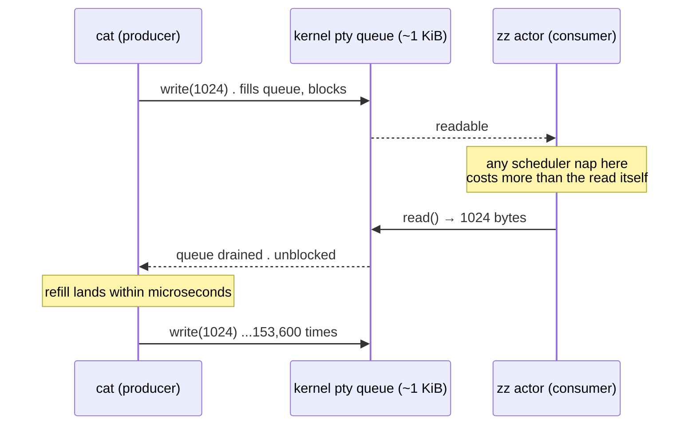
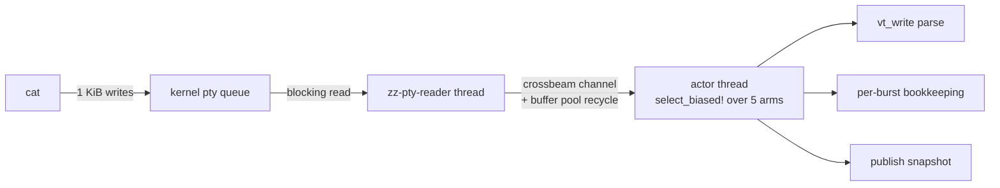
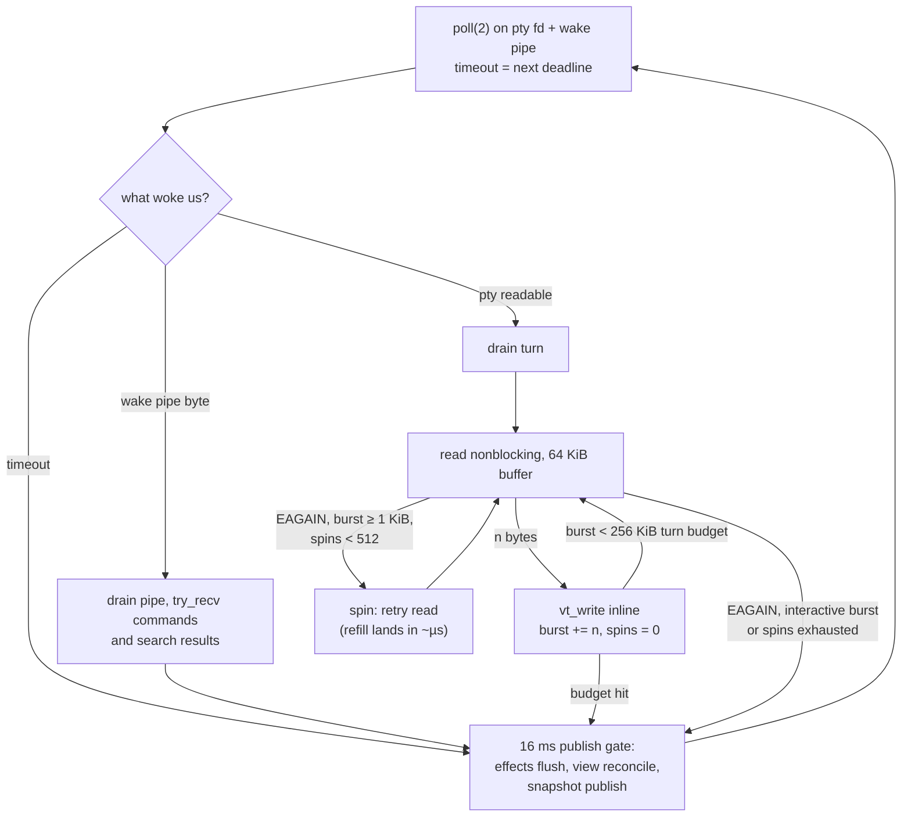
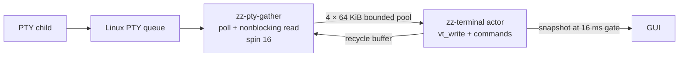
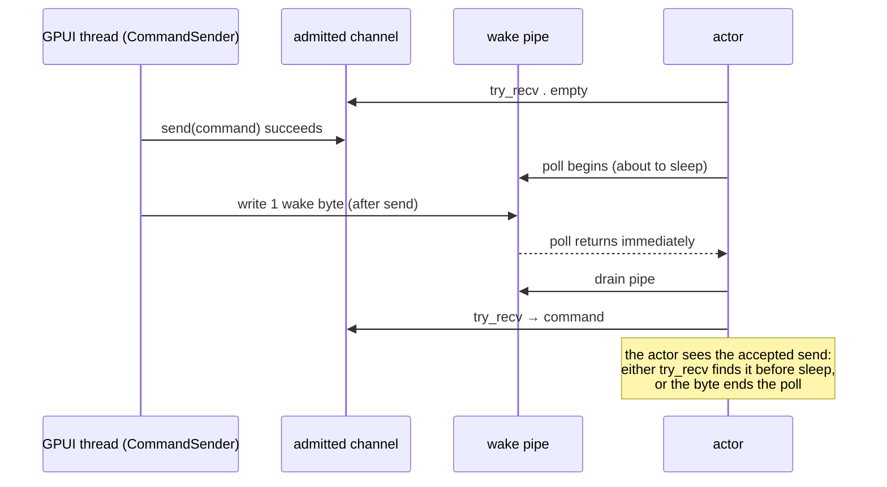

# Overview

`run_terminal` in `session.rs` is the terminal actor. It owns the libghostty-vt state (see
[libghostty-vt](/terminal/libghostty-vt.md)), command handling, and snapshot publishing.
macOS and other Unix targets drain the PTY inline with the actor. Linux gives PTY reads to
one bounded gather thread while the actor parses the previous batch. Windows keeps the
portable blocking-reader path. Each platform keeps libghostty state on the actor thread.

Benchmarked 2026-07-28 (`bench/`, Mac16,5, 180×50, medians of 5 hyperfine runs):

| terminal | cat 150 MiB ascii | cat 150 MiB unicode | DOOM-fire fps |
| --- | ---: | ---: | ---: |
| **zz (this design)** | **342.4 MB/s** | **99.0** | **671.5** |
| ghostty tip (nightly termio) | 293.6 | 94.1 | 650.5 |
| cmux (embeds ghostty tip) | 284.9 | 85.9 | 627.4 |
| ghostty 1.3.2 stable | 94.3 | 68.9 | 630.5 |
| zz before this design | 161.1 | 108.0 | 631.7 |

Benchmarked 2026-08-05 on Linux 7.1.5, Ryzen 7 7800X3D, exact 180×50 grid:

| terminal/path | cat 150 MiB ASCII | cat 150 MiB mixed UTF-8 | DOOM-fire fps |
| --- | ---: | ---: | ---: |
| zz inline actor | 444.39 MB/s | 74.43 MB/s | 1043.94 |
| **zz Linux gather** | **644.09 MB/s** | **79.85 MB/s** | **1283.80** |
| strongest submitted rival | Ghostty-tip 636.94 | Rio 123.58 | Alacritty 1255.05 |

The Linux ASCII result uses 15 runs with a 232.888 ms median. Its individual runs span
232.170–234.539 ms. The DOOM result uses the benchmark's full 30-second duration.

# The physics: a 1024-byte bucket brigade

A macOS pty hands the consumer **exactly 1024 bytes per read** during a flood, no matter the
buffer size offered, and the producer blocks after filling that queue. Baud, termios flags,
and buffer sizes do not change this (probed exhaustively . see the constants' doc comments).
So 150 MiB = 153,600 mandatory exchanges, and throughput is purely:

```
throughput = 1 KiB / (cost of one producer↔consumer exchange)
```



Every microsecond shaved off one exchange is ~150 ms off the benchmark. The design question
is therefore: **what does the consumer pay per exchange?**

# Three topologies, one lesson each

## v1 . reader thread + channel (161 MB/s)



Per exchange this paid: the reader's wake out of `read()`, a channel send, the actor's pass
through crossbeam `select_biased!` (which registers/unregisters every arm on every call),
buffer-pool recycling, and **full bookkeeping** . effects flush, `active_screen()` FFI,
view reconcile . per ~1 KiB message. Measured ceiling ~162 MB/s headless, and a C probe of
the same two-thread shape confirmed the topology itself was the limit.

*Lesson: the hop is expensive, but so is everything you casually do "per burst" when a burst
is one kilobyte.*

## v2 . naive inline actor (125 MB/s . worse!)

First rewrite: actor owns the fd, sleeps in `poll(2)`, and per wake does
`poll → read → FIONREAD → parse → full bookkeeping`. It **regressed**, and `sample(1)`
showed 66% of actor time asleep inside `poll` waiting for cat's next kilobyte. The raw
probe explained it:

| consumer strategy (raw pump, no parse) | MB/s |
| --- | ---: |
| poll(2) then read, per KiB | 136 |
| blocking read loop | 218 |
| nonblock read + spin 64 on EAGAIN | 281 |
| nonblock read + spin 256 | 332 |
| **nonblock read + spin 512** | **348** |
| FIONREAD-gated spin (any budget) | 19–66 |

*Lessons: (a) `poll` per quantum costs ~40% of everything; (b) sleeping at all mid-flood is
the real tax . the refill you're waiting on lands in microseconds; (c) FIONREAD never
observes the refill in time and spinning on it is catastrophic. The 2026-07-27 conclusion
"a bounded spin measured 7x worse, never spin" was true only of the FIONREAD shape.*

## v3 . inline actor with spin bridge (342 MB/s, shipped)



Per exchange during a flood: one nonblocking `read`, one `vt_write`, and a handful of spent
spins. No wake, no hop, no bookkeeping. Everything else happens once per 16 ms frame or
once per 256 KiB turn.

# The code, piece by piece

All symbols live in `crates/zz-terminal/src/session.rs`. The compile-time split keeps the
macOS inline path under `cfg(all(unix, not(target_os = "linux")))`, selects
`gather_pty_linux` on Linux, and retains `read_pty` for non-Unix targets.

## The Linux gather pipeline (`gather_pty_linux`)

Linux PTY reads average about 2.9 KiB and vary across 1, 2, 3, 5, and 7 KiB, with occasional
64 KiB reads. A pure PTY pump drained the 150 MiB fixture in 250–254 ms. The pinned
libghostty parser consumed the same ASCII fixture in 83.75 ms. The former inline actor paid
both costs in series:

```
254 ms PTY drain + 84 ms parse = 338 ms predicted
337.55 ms observed
```

The Linux path rotates four preallocated 64 KiB buffers through bounded Crossbeam channels.
The gather thread owns `read` and `poll`; the actor consumes at most four batches per turn
and returns each buffer to the pool. A full ring stops PTY reads and lets kernel flow control
backpressure the child.



A partial batch below 1 KiB goes to the actor at its first `EAGAIN`. Saturated output gets
16 direct read retries, enough to bridge Linux queue refills without the 512-spin macOS
budget. The actor sleeps in `select_biased!`, with commands and search results ahead of PTY
output. The channels wake it without a Unix self-pipe.

## The macOS inline spin bridge (`Wake::PtyReadable` arm)

The constants carry their own justification:

```rust
/// A burst at least this large is a saturated stream, not interactive echo;
/// only then is an empty queue worth bridging with spin retries.
const PTY_BRIDGE_THRESHOLD_BYTES: usize = 1024;
/// Nonblocking read retries that bridge a saturated producer's ~µs kernel
/// queue refill gap before giving up and sleeping in poll(2). Probed on
/// Mac16,5/macOS 27: blocking reads 218 MB/s, poll-per-KiB 136, spin 64/256/
/// 512 → 281/332/348. FIONREAD-gated spins (the 2026-07-27 "7x worse" scar)
/// never observe the refill and are NOT the same thing.
const PTY_BRIDGE_SPIN_MAX: u32 = 512;
```

The drain turn itself:

```rust
let mut burst = 0_usize;
let mut spins = 0_u32;
let turn_started = Instant::now();
loop {
    match rustix::io::read(&drain_fd, &mut read_buffer[..]) {
        Ok(0) => { reader_eof = true; break; }
        Ok(length) => {
            terminal.vt_write(&read_buffer[..length]);
            output_pending = true;
            burst += length;
            spins = 0;
            if burst >= PTY_DRAIN_TURN_BYTES             // service commands
                || turn_started.elapsed() >= PTY_DRAIN_TURN_TIME { break; }
        }
        Err(rustix::io::Errno::INTR) => {}
        Err(rustix::io::Errno::AGAIN) => {
            if burst >= PTY_BRIDGE_THRESHOLD_BYTES && spins < PTY_BRIDGE_SPIN_MAX {
                spins += 1;
                continue;                                 // bridge the refill gap
            }
            break;                                        // interactive, or burst over
        }
        Err(_) => { reader_eof = true; break; }           // EIO: slave closed
    }
}
```

The two guards are the whole latency story: an interactive echo (burst < 1 KiB) hits the
first `EAGAIN` and falls straight back to the poll sleep . an idle pane burns nothing .
while a saturated stream stays hot. The turn budget is bounded twice: in bytes
(`PTY_DRAIN_TURN_BYTES`, 256 KiB ≈ 0.8 ms at the release bench's ~320 MB/s cat-ascii
rate) and, since 2026-08-19, in wall time (`PTY_DRAIN_TURN_TIME`, 1 ms). The byte bound
is the fast-path break; the time bound is what the actor's 2 s command budgets actually
assume, and it holds even when the parser runs far below the byte bound's assumed rate —
under loaded parallel test runs with a Zig `Debug` VT build, a single 256 KiB turn was
observed stretching to ~2.8 s (that figure is the dev-profile daemon test environment
under CPU contention, not the release bench), blowing every capture timeout behind it
before the time bound existed.

## The macOS sleep and wake pipe (`wait_for_wake`, `ActorWake`)

The actor sleeps in `rustix::event::poll` on two fds: the pty and a self-pipe. `CommandSender` and the
search worker write one byte to the pipe **after** each successful channel send. `InputSender`
rejects a full command before this step. The actor re-checks its channels before every sleep:



Control commands retain priority over PTY input and output because the actor checks the control lane
first on every wake. The actor excludes the PTY-input lane from the wait set whenever `PtyWriter` has
a backlog, while PTY reads, resize, capture, and pure view actions keep running. Continuing reads lets
an echoing terminal or a full-duplex child consume input without deadlocking behind its own output.
Output views and non-Unix targets use `ActorWake::none()`: the same call sites, zero cfg noise.

## The 16 ms gate (bookkeeping moved out of the hot loop)

v2's other mistake was running per-burst bookkeeping per kilobyte. Now `output_pending`
is the only thing the drain sets; the top of the loop owns the rest:

```rust
if output_pending
    && (reader_eof || last_content_publish.elapsed() >= CONTENT_PUBLISH_STALENESS)
{
    drain_effects_if_writer_ready(&effects, &mut writer)?; // pty query replies
    let output_screen = terminal.active_screen()?; // FFI . once per frame now
    /* note_output for every view, reconcile_view_screen, search debounce */
    publisher.publish(snapshot(/* Content */)?);
    last_content_publish = Instant::now();
    output_pending = false;
}
```

Interactive output still publishes immediately (elapsed is ≥ 16 ms when a pane was quiet);
a flood pays for effects flushes, view reconciliation, and the snapshot **once per frame
instead of once per kilobyte**. The gate is also where parse-rate visibility lives: each
drain site accumulates bytes and elapsed µs into a `VtWriteDiagnostics` local (armed only
when `zz_terminal::diagnostics` is at trace, a relaxed atomic check per read) and the gate
emits one `vt_write parsed_bytes= calls= elapsed_us=` line per publish under the
`zz_terminal::diagnostics::vt` target — the only measurement of `vt_write` itself. Note
the arming gate is the parent target, which also arms the per-read raw-byte dump under
`zz_terminal::diagnostics::pty`; to time the parser without drowning in byte dumps, use
`zz_terminal::diagnostics=trace,zz_terminal::diagnostics::pty=warn`. The trade: terminal query replies (DA/DSR) batch up to
16 ms mid-flood when the writer is ready; the actor holds replies while prior bytes drain.
The search-refresh debounce runs from the same deadline sweep. Child status arrives as an event from the per-session
`zz-child-wait` thread parked in `wait()`, so an idle actor sleeps `IDLE_SLEEP` (1 hour)
rather than waking on a status tick. The `Wake::Deadline` arm stays empty; the top of the next actor
turn handles due work, including a 16 ms writer retry.

## The writer (`PtyWriter`)

`O_NONBLOCK` is a property of the open file description, and every dup of the master shares
it . so making the drain fd nonblocking makes the *writer* nonblocking too. `PtyWriter`
wraps a second dup and keeps a FIFO byte buffer. Each `Write` queues the complete slice, tries up to
1 MiB per flush attempt, and retains the remainder on `EAGAIN`; it never reports a silent partial write.
While bytes remain, the actor stops consuming further PTY input but continues PTY output and control work.
The input sender reserves each whole command before enqueueing it, with caps of 256 commands and 64
MiB including a 4 KiB per-command floor, so producers never block behind the writer and a rejected
command contributes no bytes. The actor also leaves libghostty-generated replies in the bounded
`PtyEffects` buffer until the writer drains. Symmetric gotcha to remember: you cannot make the reader
nonblocking "privately".

# Why the platforms differ

Ghostty nightly uses a gather pipeline on POSIX. Its implementation adds a 1 ms bridge poll,
a 3 ms batch budget, and an idle pipe that lets the parser interrupt a gather wait. zz uses a
smaller Linux variant: four Crossbeam-owned buffers, spin 16, and no bridge poll. Linux probing
showed that direct retries catch the next queue refill, while sending the current partial batch
keeps terminal-query latency bounded.

macOS keeps the inline actor because its 1 KiB PTY queue made the old per-batch channel hop cost
more than the parse overlap saved. Linux's deeper queue amortizes the channel hop across much
larger batches. The snapshot seam described in [rendering-parity](/terminal/rendering-parity.md)
also keeps both paths independent from GPUI paint locks.

An exact-grid `perf` capture assigns 0.37% of sampled user cycles to `zz-pty-gather`, 44.71%
to the terminal actor, and 54.46% to the GUI. The gather thread spends most of its time in
kernel reads and lets the actor use its core for parsing.

# Traps for whoever touches this next

* **EAGAIN-spin ≠ FIONREAD-spin.** Retrying `read` on a nonblocking fd sees the refill;
  polling FIONREAD does not (19–66 MB/s, catastrophic). Do not "simplify" the bridge into
  an ioctl loop.
* **The spin budgets are platform-specific.** `PTY_BRIDGE_SPIN_MAX = 512` belongs to the
  macOS inline path. Linux uses `PTY_GATHER_BRIDGE_SPIN_MAX = 16`; changing one must not
  move the other platform onto the same topology.
* **Do not add per-read logging or FFI work.** The macOS path pays it per 1 KiB exchange,
  and the Linux gather thread must remain cheaper than the parser it overlaps. The
  `VtWriteDiagnostics` accumulation is the allowed exception: off, it costs one relaxed
  atomic load per read; on, everything still buffers into a local and logs once per 16 ms
  publish.
* **The Zig optimize mode of the VT engine dominates every number here.**
  `libghostty-vt-sys`'s build script checks Cargo's `DEBUG` env before `OPT_LEVEL`, so
  until 2026-08-19 every dev/test build silently compiled the parser at Zig `Debug` —
  roughly 6x slower, which is what caused the daemon's load-flake set (pipe throughput
  1.36 → 7.75 MB/s when A/B'd against `ReleaseSafe`). Dev builds now default to
  `ReleaseSafe` (safety checks kept, optimizer on); release stays `ReleaseFast` via
  `OPT_LEVEL`; `LIBGHOSTTY_VT_SYS_OPTIMIZE` overrides everything for anyone actually
  debugging Zig code. Do not benchmark, profile, or chase timing flakes without first
  confirming which mode the archive was built at. One more scar: the `ReleaseSafe`
  archive built from Ghostty pin `7aa9591` interposed a `memset` whose C ABI was wrong
  (it took the fill as a byte, not an `int` truncated to its low byte), which corrupted
  Rust hash tables in any statically linked binary — deterministic infinite probe loops
  in plain `HashMap::insert`. The pin now sits at the upstream fix (`20c3eae`); if a
  future pin bump resurrects inexplicable hangs in pure-Rust map code, suspect the
  archive's exported libc symbols first. (The 6x parse factor is the research estimate;
  the daemon's own end-to-end pipe test measured 5.7x.)
* **Keep the Linux ring bounded and ordered.** The actor must parse every data batch before
  EOF, return buffers after `vt_write`, and stop draining when all four buffers are in flight.
* **The unicode fixture solicits thousands of DA responses**; their shell echo floods the
  viewport and garbles capture-based smoke tests. Time headless runs with a
  `; touch /tmp/marker` sentinel and wall-clock polling, never `capture-pane | rg`.
* **Windows still runs the v1 reader-thread path** (`cfg(not(unix))`); CI builds it. Keep
  `read_pty` and friends compiling until someone ports the inline drain to overlapped IO.
